# TC Electronic G-Force — Посібник користувача

Український переклад оригінального посібника TC Electronic G-Force. Назви меню, кнопок, параметрів і presets залишені англійською, як у оригіналі.

## Безпека та нормативні вимоги

1. Прочитайте ці інструкції.
2. Зберігайте ці інструкції.
3. Дотримуйтесь усіх попереджень.
4. Виконуйте всі інструкції.
5. Не використовуйте цей апарат поблизу води.
6. Чистіть лише сухою ганчіркою.
7. Не закривайте вентиляційні отвори.
Встановлюйте відповідно до інструкцій виробника.

8. Не встановлюйте поблизу джерел тепла, таких як радіатори, тепловентилятори, плити або інші пристрої (включно з підсилювачами), що виділяють тепло.
9. Не порушуйте мету безпеки поляризованої або заземлювальної вилки.
Поляризована вилка має два штифти, один з яких ширший за інший.

Вилка заземлювального типу має два штифти та третій заземлювальний контакт.

Широкий штифт або третій контакт призначені для вашої безпеки.

Якщо надана вилка не підходить до вашої розетки, зверніться до електрика для заміни застарілої розетки.

10. Захищайте силовий кабель від наступання або перетискання, особливо в місцях вилок, розеток і там, де він виходить з апарату.
11. Використовуйте лише аксесуари/додаткові пристрої, зазначені виробником.
12. Від’єднуйте цей апарат від мережі під час грози або коли він довго не використовується.
Використовуйте лише з візком, підставкою, штативом, кронштейном або столом, зазначеним виробником або проданим разом з апаратом.

Під час використання візка будьте обережні під час переміщення комбінації візок/апарат, щоб уникнути травм від перекидання.

13. Усі роботи з обслуговування доручайте кваліфікованому персоналу.
Обслуговування потрібне, коли апарат у будь-який спосіб пошкоджено, наприклад пошкоджено силовий кабель або вилку, на апарат пролито рідину або в нього потрапили сторонні предмети, апарат піддавався дощу або волозі, не працює нормально або його впустили.

- Це обладнання слід встановлювати поблизу розетки, а від’єднання пристрою має бути легко доступним.
- Для повного від’єднання від мережі змінного струму від’єднайте силовий кабель від розетки змінного струму.
- Мережна вилка блоку живлення має залишатися легко доступною для використання.
- Не встановлюйте в замкненому просторі.
- Не відкривайте блок — всередині ризик ураження електричним струмом.

Caution:  Вас попереджають, що будь-які зміни або модифікації, які прямо не схвалені в цьому посібнику, можуть позбавити вас права на експлуатацію цього обладнання.

### Сервіс

- Усередині немає деталей, які можна обслуговувати користувачеві.
- Усі роботи з обслуговування має виконувати кваліфікований персонал.

### Попередження!

- Щоб зменшити ризик пожежі або ураження електричним струмом, не піддавайте це обладнання краплям або бризкам і переконайтеся, що на обладнанні не розміщено предметів із рідиною, наприклад ваз.
- Цей апарат має бути заземлений.
- Використовуйте трьохжильний кабель заземлювального типу, як той, що постачається з продуктом.
- Зверніть увагу, що для різних робочих напруг потрібні різні типи кабелів і вилок.
- Перевірте напругу у вашому регіоні та використовуйте правильний тип. Див. таблицю нижче:

| Напруга | Вилка згідно зі стандартом |
| :--- | :--- |
| 110–125 V | UL817 and CSA C22.2 no 42. |
| 220–230 V | CEE 7 page VII, SR section 107-2-D1/IEC 83 page C4. |
| 240 V | BS 1363 of 1984. Specification for 13A fused plugs and switched and unswitched socket outlets. |

Part 1: Emission. EN 55103-2   Product family standard for `audio`, video, `audio`-visual and entertainment lighting `control` apparatus for professional use.

Part 2: Immunity. З посиланням на положення таких директив: 73/23/EEC, 89/336/EEC  Видано в Risskov, травень 1997 Anders Fauerskov Managing Director  Це обладнання пройшло випробування і відповідає обмеженням для цифрового пристрою Class B відповідно до частини 15 правил FCC.

Ці обмеження розроблені для забезпечення розумного захисту від шкідливих перешкод у житлових установках.

Це обладнання генерує, використовує та може випромінювати радіочастотну енергію і, якщо воно не встановлене та не використовується відповідно до інструкцій, може спричиняти шкідливі перешкоди радіозв’язку.

Однак немає гарантії, що перешкоди не виникнуть у конкретній установці.

Якщо це обладнання спричиняє шкідливі перешкоди прийому радіо- або телесигналу, що можна визначити, вмикаючи та вимикаючи обладнання, користувачеві рекомендується спробувати усунути перешкоди одним або кількома з таких заходів:

- Переорієнтуйте або перемістіть приймальну антену.
- Збільшіть відстань між обладнанням і приймачем.
- Під’єднайте обладнання до розетки в іншому ланцюзі, ніж той, до якого під’єднано приймач.
- Зверніться до дилера або досвідченого радіо/TV техніка за допомогою.

### Для клієнтів у Канаді:

This Class B digital apparatus complies with Canadian ICES-003.

Cet appareil numérique de la classe B est conforme à la norme NMB-003 du Canada.

## Про цей посібник

Цей посібник описує кнопки, ручки, контролери, входи та виходи, створення User preset, підключення Modifiers, налаштування Expression pedal, виклик і збереження preset, I/O, MIDI та системні параметри.

| Розділ | Опис | Стор. |
| :--- | :--- | ---: |
| **ВІТАЄМО** | *Про цей посібник* | 7 |
| **З ТОЧКИ ЗОРУ КОРИСТУВАЧА** | *Передмова Palle Schultz* | 7 |
| **КОРОТКИЙ ДОВІДНИК** | *Кнопки, ручки, контролери та інші функції* | 9 |
| **ПЕРЕДНЯ ПАНЕЛЬ** | | 10 |
| **ЗАДНЯ ПАНЕЛЬ** | *Входи, виходи* | 12 |
| **СХЕМА СИГНАЛУ** | | 13 |
| **ЯК…** | *Створення User Preset, підключення Modifiers, налаштування Expression Pedal тощо* | 14 |
| **ПІДКЛЮЧЕННЯ** | *Системи підключення гітари* | 18 |
| **RECALL** | *Виклик Preset, Factory/User presets, memory card* | 19 |
| **STORE** | *Збереження нового preset, Letterbox* | 19 |
| **EFFECTS** | *Effects, Routing та Layout* | 22 |
| **I/O MENU** | *I/O, Input selector, Sample Rate, Mix, MIDI setup* | 29 |
| **MODIFIERS** | | 25 |
| **UTILITY** | *Системні параметри, налаштування Billboard* | 48 |
| **TEMPO** | | 48 |
| **TUNER** | | 48 |
| **БЛОКИ** | *Опис блоків ефектів* | 34 |
| **RESET PAGE** | | 48 |
| **ТЕХНІЧНІ ХАРАКТЕРИСТИКИ** | | 53 |
| **УСУНЕННЯ НЕСПРАВНОСТЕЙ** | | 55 |
| **MIDI IMPLEMENTATION CHART** | | 55 |
| **SELF TEST** | | 57 |
| **СПИСОК PRESETS** | | 59 |

**Виробник:** TC Electronic, Sindalsvej 34, DK-8240 Risskov — tcdk@tcelectronic.com  
**Rev** 1.01 — SW V 2.04 — Prod No: 606055012

## Вітаємо

Вітаємо з придбанням вашого нового G-Force.

Сподіваємося, що вам буде так само приємно користуватися ним, як нам було приємно його створювати.  G-Force ретельно спроєктований для створення найкращих гітарних ефектів.

Для цього ми надали вам вісім безкомпромісних одночасних ефектів.

Це означає, що G-Force має потужність для роботи всіх восьми ефектів без втрати якості звуку.

Ви можете маршрутизувати блоки ефектів у будь-якій комбінації, а 24-бітні конвертери дозволяють пропускати гітару напряму без line-mixer, зберігаючи оригінальний гітарний тон.

Ознайомтеся з Modifier Matrix і відкрийте потужний інструмент для зовнішнього та внутрішнього керування в реальному часі багатьма параметрами G-Force.

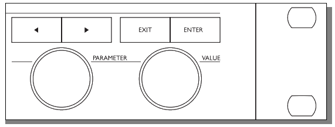

### Про цей посібник

Багато людей у музичній індустрії (і не лише) не люблять читати посібники. Ми це розуміємо.

Тому якщо ви хочете почати без читання всього посібника — просто починайте.

Ви завжди можете скористатися посібником, щоб перевірити розділи, у яких маєте запитання, або якщо хочете глибше розібратися в пристрої.

Для додаткової інформації зверніться до змісту. З іншого боку, можливо, ви хочете дізнатися трохи більше про G-Force, перш ніж почати натискати клавіші.

Посібник крок за кроком проведе вас через усі функції G-Force.

Якщо ви хочете прочитати про конкретну функцію, зверніться до змісту.

### З точки зору користувача

Якщо ви відмовитеся від улюблених stomp boxes і інвестуєте гроші в multi-`effects` unit, найімовірніше втратите простоту та гнучкість вашої педальної схеми.

Вам часто доведеться мати справу з посібниками розміром із телефонної книги та інтерфейсами, створеними комп’ютерними фахівцями для комп’ютерних фахівців.

Такі обставини часто відлякують творчих людей і музикантів від подібної «космічної» техніки. Я володів кількома різними ефект-процесорами, кожен з яких мав власну версію ворожого інтерфейсу, тому довго чекав, поки хтось розробить multi-effect, який не суперечить творчому стану розуму.

Той факт, що розробниками стали люди з TC Electronic, гарантує якість усього продукту. G-FORCE — дуже гнучка машина, з якою дуже легко працювати.

Ви можете просто використовувати її як лінійний ланцюг ефектів або вийти за межі будь-якого відомого multi-effect unit і дослідити безліч комбінацій і можливостей керування в G-FORCE.

Після невеликого часу використання G-Force я повністю змінив свій підхід до створення ефектів для гітари.

Від простого використання стандартних ефектів на кшталт `Delay`, `Chorus` і `Reverb`, з’єднаних у прямій лінії, я тепер придумую неіснуючі ефекти, наприклад: Tremolo, який спрацьовує лише на високих нотах, тоді як рівень phased distorted dark `Delay` керується вашою старою volume pedal, відкаліброваною для G-FORCE.

Якщо ви зовсім новачок у цифровій техніці на кшталт G-FORCE і є завзятим «крутильником ручок», але вас дратує робота зі scroll bars, LCD-дисплеями та дивними технічними термінами — ви купили правильний продукт. TC Electronic G-FORCE настільки простий у використанні, що навіть дивно, що цей посібник взагалі існує.

Коли ви пересуваєтеся G-FORCE і хочете, щоб сталося певне, і відчуваєте, що саме цей Parameter варто налаштувати — ви, найімовірніше, праві.

Цю машину вивчають, користуючись нею; не бійтеся крутити все до максимуму — на межі й відбувається навчання, і звідти ви або «падаєте», або відступаєте назад.

Класна річ у G-FORCE — ви не «поранитеся», якщо перейдете межу, але можете отримати найдивніший або найкрутіший новий ефект, який коли-небудь чули.

Одним дуже приємним побічним ефектом володіння G-FORCE є різко полегшений rack.

Мій, безумовно, «схуд» до крихітного потужного блоку розміром із болід Формули-1.

### Palle Schultz

## Короткий довідник

Загальне керування G-Force здійснюється обертанням `Parameter wheel` для зміни параметрів і `Value wheel` для зміни значень. У багатьох дисплеях можна вибирати різні меню натисканням клавіш `Arrow keys`, наприклад, у дисплеї `Effects` можна вибрати `Mix`, `Edit`, `Routing` і `Layout`.

Натисніть `Enter`, щоб виконати дію (наприклад, під час виклику `preset`).

#### Recall

Натисніть `Recall` (якщо ви ще не там).

Переконайтеся, що курсор розташований на «`Preset`», і обертайте `Value wheel` для прокручування presets.

Натисніть `Enter`, щоб завантажити новий `preset`.

#### Quick Store

Якщо ви хочете зберегти `preset` з тим самим ім’ям, натисніть `Store`, щоб відкрити меню `Store`, і натисніть `Enter` для підтвердження. G-Force автоматично збереже ваш `preset` у першому вільному `User` space, використовуючи поточне ім’я.

Коли ви намагаєтеся відновити існуючий `User` `preset`, G-Force за замовчуванням пропонує той самий номер `User` `preset`.

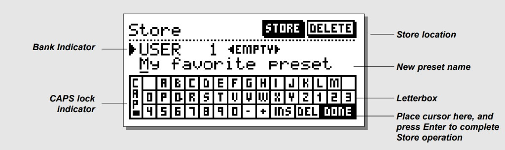

#### Editing

Натисніть `Effects` і виберіть дисплей `Edit` за допомогою клавіш `Arrow keys`.

Двічі натисніть `bypass key` блоку, який хочете редагувати.

### Налаштування MIDI board

Натисніть `I/O Setup` і виберіть `MIDI` за допомогою клавіш `Arrow keys`.

Налаштуйте `MIDI` Basic channel так, щоб він відповідав каналу вашого foot controller.

Переконайтеся, що Program Change увімкнено.

Ваш foot controller тепер має змінювати presets на G-Force.

Якщо ви хочете викликати `User` presets через `MIDI`, прокрутіть вниз до Mapping Mode і виберіть «into `User` bank» обертанням `Value wheel`.

### Налаштування Expression Pedal

Під’єднайте педаль моно гітарним кабелем до `External `Control` In`.

Натисніть `I/O Setup` і виберіть `Control` за допомогою клавіш `Arrow keys`. У цьому списку є низка параметрів, якими можна керувати Expression pedal.

Налаштуємо керування Main volume.

Розмістіть курсор на «`Main Vol`» — натисніть `Enter` (для Learning) і рухайте педаль. G-Force автоматично визначить вашу педаль.

Функції Ext. 1-8 налаштовуються в Modifiers Matrix.

#### Input/Output

Використовуйте ручки `Input/Output` у верхньому лівому куті передньої панелі для регулювання рівнів G-Force.

Якщо ви використовуєте G-Force у моно-конфігурації, виберіть L-only в `I/O setup`, `Audio` menu.

Це меню також надає інформацію про I/O gain.

Функцію `Killdry` слід увімкнути (On), якщо ви використовуєте G-Force у parallel setup, тобто в поєднанні з line mixer.

## Передня панель

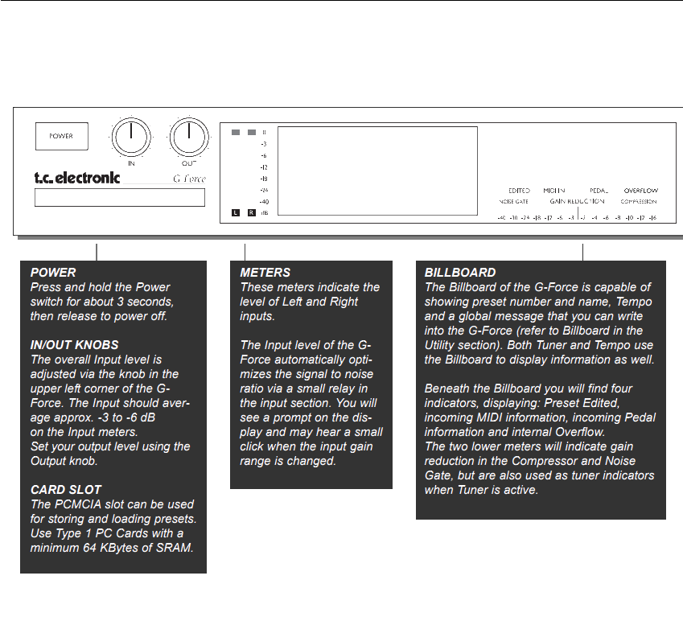

#### POWER

Натисніть і утримуйте `Power switch` близько 3 секунд, потім відпустіть, щоб вимкнути живлення.

#### IN/OUT KNOBS

Загальний Input level регулюється ручкою у верхньому лівому куті G-Force.

Input має в середньому показувати приблизно -3 до -6 dB на Input `meters`.

Встановіть Output level за допомогою ручки Output.

#### CARD SLOT

Слот PCMCIA можна використовувати для збереження та завантаження presets.

Використовуйте Type 1 PC Cards мінімум із 64 KBytes SRAM.

#### BILLBOARD

`Billboard` G-Force може показувати номер і ім’я `preset`, `Tempo` та глобальне повідомлення, яке ви можете записати в G-Force (див.

`Billboard` у розділі `Utility`).

`Tuner` і `Tempo` також використовують `Billboard` для відображення інформації.

Під `Billboard` ви знайдете чотири індикатори, що показують: `Preset` Edited, вхідну `MIDI` інформацію, вхідну Pedal інформацію та internal Overflow.

Два нижні індикатори показують gain reduction у `Compressor` і `Noise Gate`, але також використовуються як індикатори `Tuner`, коли `Tuner` активний.

#### METERS

Ці індикатори показують рівень лівого та правого входів.

Input level G-Force автоматично оптимізує співвідношення сигнал/шум за допомогою невеликого реле у вхідній секції.

На дисплеї з’явиться підказка, і ви можете почути невеликий клацання під час зміни діапазону input gain.

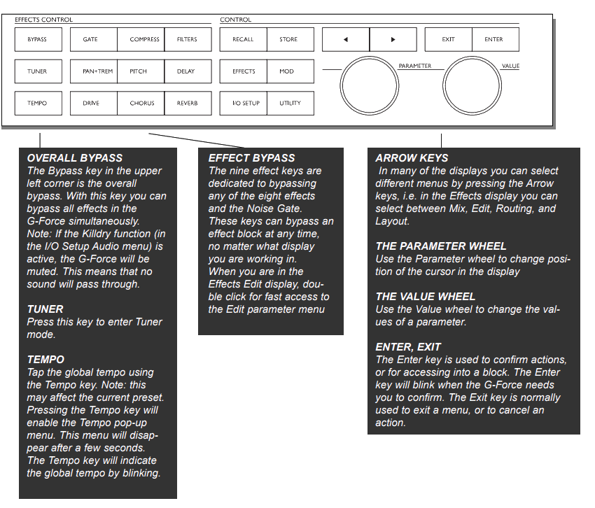

#### OVERALL BYPASS

Клавіша `Bypass` у верхньому лівому куті — це `overall bypass`.

Цією клавішею можна одночасно `bypass` усі ефекти в G-Force.

Примітка: якщо функція `Killdry` (у меню `I/O Setup` `Audio`) активна, G-Force буде заглушено (muted).

Це означає, що звук не проходитиме.

#### TUNER

Натисніть цю клавішу, щоб увійти в режим `Tuner`.

#### TEMPO

Відстукайте global `tempo` клавішею `Tempo`.

Примітка: це може вплинути на поточний `preset`.

Натискання клавіші `Tempo` відкриє спливаюче меню `Tempo`.

Це меню зникне через кілька секунд.

Клавіша `Tempo` індикує global `tempo` миготінням.

#### ARROW KEYS

У багатьох дисплеях можна вибирати різні меню натисканням `Arrow keys`, тобто в дисплеї `Effects` можна вибрати `Mix`, `Edit`, `Routing` і `Layout`.

#### THE PARAMETER WHEEL

Використовуйте `Parameter wheel` для зміни позиції курсора на дисплеї

#### THE VALUE WHEEL

Використовуйте `Value wheel` для зміни значень Parameter.

#### ENTER, EXIT

Клавіша `Enter` використовується для підтвердження дій або для входу в блок.

Клавіша `Enter` блиматиме, коли G-Force потребує вашого підтвердження.

Клавіша `Exit` зазвичай використовується для виходу з меню або скасування дії. 9

#### EFFECT BYPASS

Дев’ять клавіш ефектів призначені для `bypass` будь-якого з восьми ефектів і `Noise Gate`.

Ці клавіші можуть `bypass` блок ефекту в будь-який момент, незалежно від того, в якому дисплеї ви працюєте.

Коли ви в дисплеї `Effects` `Edit`, двічі натисніть для швидкого доступу до меню `Edit` parameter

## Задня панель

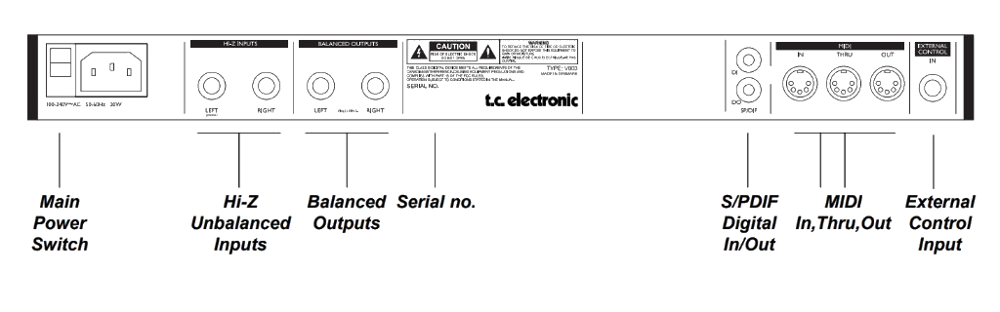

**Примітки:**

 Hi-Z Unbalanced Inputs Balanced Outputs Serial no.   S/PDIF Digital In/Out `MIDI` In,Thru,Out `External Control` Input Примітки: Вхідні роз’єми G-Force незбалансовані.

Вихідні роз’єми збалансовані.

Якщо ви під’єднуєте Outputs стереороз’ємами до незбалансованого обладнання, потрібно з’єднати ring і sleeve разом на кінцях кабелів на відстані від G-Force.

Ви завжди можете використовувати стандартні моно гітарні кабелі для під’єднання G-Force.

Вхід `External control` input може використовувати momentary, alternating і continuous type pedals.

Блок живлення G-Force здатний працювати при будь-якій мережевій напрузі від 100-240 Volts, 50-60Hz.

## Схема сигналу

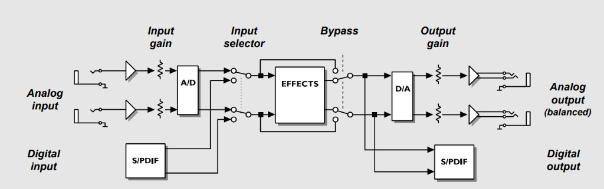

**Примітки щодо signal flow:**

- Сигнал завжди присутній на Analog і Digital outputs.
- G-Force обмежений частотою дискретизації 44.1 kHz на Analog і Digital inputs.
- Input level G-Force автоматично оптимізує співвідношення сигнал/шум за допомогою невеликого реле у вхідній секції. На дисплеї з’явиться підказка, і ви можете почути невеликий клацання під час зміни діапазону input gain.

## Як налаштувати ефекти

Це покроковий посібник з деяких основних функцій, які використовуються під час створення власних presets.

Почніть із виклику factory `preset` #225 під назвою «`Empty Routing`»:

- Натисніть `Recall`.
- Обертайте `Value wheel`, доки не побачите `preset` 225.
- Натисніть `Enter`, щоб викликати поточний `preset`.

### Налаштування ефекту

Є два способи вставити ефект.

Почнемо з налаштування `Reverb`.

- Натисніть клавішу `Effects`.
- Використовуйте клавіші `Arrow keys`, щоб вибрати дисплей `Routing`.
- Використовуйте `Parameter wheel`, щоб розмістити курсор у третій позиції першого стовпця.
- Двічі натисніть `Reverb` `bypass key`, щоб вставити `Reverb`.

Інший спосіб:

- Натисніть клавішу `Effects`.
- Використовуйте клавіші `Arrow keys`, щоб вибрати дисплей `Routing`.
- Обертайте `Value wheel`, доки не побачите «REV», і натисніть `Enter`, щоб вставити `Reverb` у `Routing`.

### Редагування ефекту

Є два способи потрапити в дисплей `Edit` parameter.

Ось перший і найпростіший — після натискання клавіші `Effects`:

- Використовуйте клавіші `Arrow keys` для доступу до дисплею `Edit`.
- Двічі натисніть `Reverb` `bypass key`.
- Використовуйте `Parameter wheel` для прокручування вгору та вниз, а `Value wheel` — для зміни значень.

Інший спосіб — після натискання клавіші `Effects`:

- Використовуйте клавіші `Arrow keys` для доступу до дисплею `Edit`.
- Обертайте `Parameter wheel`, щоб перемістити курсор на блок `Reverb`.
- Натисніть `Enter` для доступу до дисплею `Edit` parameter.
- Використовуйте `Parameter wheel` для прокручування вгору та вниз, а `Value wheel` — для зміни значень.
- Натисніть `Exit`, щоб вийти з дисплею `Edit` parameter, або знову двічі натисніть `Reverb` `bypass key`.  12  двічі натисніть `bypass key` поточного блоку одразу, і G-Force вийде з першого, а потім відкриє другий.

### Як установити рівень preset

Є кілька способів встановити рівень `preset`, але в будь-якому разі варто залишити певний запас (headroom) для `preset`, який має бути найгучнішим.

Один метод — знизити Input (або Output) level останнього блоку в `routing`.

Це означає, що якщо блоки з’єднані паралельно, доведеться змінювати рівень однаково, щоб зберегти співвідношення між поточними ефектами.

Інший спосіб — використати Level у секції In.

Цей рівень розташований після `Noise Gate`, але перед усім іншим.

Цей In Level також присутній у Modifier Matrix, що означає, що ви можете керувати ним через expression pedal.

### Як додати блок до Routing

Тепер у нас є `Reverb`, але ми також хочемо `Delay`.

Потрібно вирішити, чи потрібен `Delay` паралельно або послідовно (series) відносно `Reverb`.

Спробуємо parallel — з меню `Routing`:

- Розмістіть курсор у другій позиції першого стовпця за допомогою `Parameter wheel`.
- Двічі натисніть `Delay` `bypass key`, щоб вставити блок `Delay`.

Якщо блоки працюють паралельно, варто продумати стратегію `Mix`.

Може бути розумно запускати всі ефекти, крім одного, з `Mix` 100% і використовувати In/Out level для балансування рівня ефектів відносно один одного.

### Як змінити sub-algorithm

`Delay`, який ви щойно вставили, — це Stereo `Delay`, що використовує однаковий `delay` time в лівому та правому каналах.

Спробуємо знайти `delay` з різним часом у лівому та правому:

- Перемістіть курсор на блок `Delay` за допомогою `Parameter wheel`.
- Натисніть `Enter`, щоб увійти в дисплей `Edit` parameter.
- Використовуйте клавішу < Arrow left, щоб перейти до списку sub-algo.
- Обертайте курсор на «Dual» за допомогою `Parameter wheel` і натисніть `Enter`, щоб змінити sub-algorithm.

Тепер у вас алгоритм Dual `delay`, де можна встановити різний `delay` time у лівому та правому каналах (не забудьте налаштувати panning двох `delay` time). Раптом згадав, що нам потрібен `Compressor` перед `Delay` і `Reverb`.

Спробуємо перемістити блоки `Delay` і `Reverb`:

- Натисніть > Arrow right, щоб перейти до дисплею `Layout`.
- Обертайте `Value wheel` на «Move R».
- Обертайте `Parameter wheel` повністю проти годинникової стрілки і натисніть `Enter`, щоб перемістити два блоки вправо.
- Натисніть < Arrow left один раз, щоб вибрати дисплей `Routing`.
- Розмістіть курсор у другій позиції першого стовпця і двічі натисніть `Compressor` `bypass key`.

Ось і все — `Compressor` перед блоками `Delay` і `Reverb`.

### Як видалити або замінити блок

Якщо ви хочете видалити блок з `routing` або просто замінити його, наприклад, змінити `Reverb` на `Chorus`, ось що робити:

- Натисніть клавішу `Effects`.
- Натисніть > Arrow right, щоб відкрити дисплей `Routing`.
- Перемістіть курсор на блок, який хочете видалити, за допомогою `Parameter wheel`.
- Обертайте `Value wheel` проти годинникової стрілки, доки блок не стане чорним або доки не побачите новий блок, який хочете, і натисніть `Enter`.

Також можна просто двічі натиснути потрібний блок.

Блок тепер видалено або замінено.

### Як зберегти ваш новий preset

Тепер, коли ми створили `preset` з `Compressor`, `Delay` і `Reverb`, настав час `Store`.

Можна зберегти дуже швидко з тим самим ім’ям або `Store` з новим ім’ям. Ось швидкий спосіб:

- Натисніть клавішу `Store`.
- Обертайте `Value wheel`, щоб вибрати місце збереження (G-Force за замовчуванням пропонує перший порожній `User` `preset`).
- Натисніть `Enter` для `Store` з тим самим ім’ям.

Ось що робити після вибору правильного місця збереження, якщо хочете зберегти з новим ім’ям:

- Обертайте `Parameter wheel` на рядок імені.
- Обертайте `Value wheel` і натисніть `Enter`, щоб вибрати літеру.
- Коли закінчите ім’я, перейдіть на «Done» за допомогою `Value wheel` і натисніть `Enter` для `Store`.

Spillover від одного `preset` до іншого можна отримати, використовуючи той самий sub-algorithm і правильний `Mute mode` у двох послідовних presets.

### Приклад:

Ви хочете, щоб хвіст `Delay` з одного `preset` продовжував звучати під час переходу на `preset` без `Delay` — ось що робити:

- Увійдіть у дисплей `Edit` Parameter `Delay` у першому `preset`.
- Прокрутіть вниз до «`Mute mode`» і виберіть «`FX In`».
- Збережіть це як `preset` 1.
- Використовуйте точно ті самі налаштування `Delay` і `Mute mode` в наступному `preset`, але `bypass` блок `Delay`.
- Збережіть це як `preset` 2.

Тепер ви можете переходити з `preset` 1 на `preset` 2 із продовженням звучання `Delay`.

### Як підключити Modifiers

G-Force має низку додаткових внутрішніх modifiers, які можуть створювати додаткові функції та змушувати presets «грати разом із вами», наприклад Envelope follower, ADSR, `Pitch` detector тощо.

Ось кілька прикладів і спосіб їх налаштування.

Вихідна точка — `preset`, який ми щойно створили вище, або `ROM` `preset` #21.

### Створення ducking Delay

Зараз у вас постійний рівень `Delay` — чи не було б добре, якби `Delay` з’являвся лише в паузах, коли ви не граєте. Спробуємо:

- Натисніть клавішу `Mod`, щоб вибрати дисплей Matrix.
- Прокручуйте горизонтально за допомогою `Value wheel`, доки не побачите «ENV» (Envelope) у верхньому рядку.
- Прокручуйте вертикально за допомогою `Parameter wheel`, доки не дійдете до точки, де «ENV» і `Delay` Outlevel перетинаються.
- Натисніть `Enter`, щоб зв’язати два параметри.

Тепер ви почуєте, як `Delay` слідує за рівнем Input, тобто коли ви граєте — грає `Delay`.

Але було б корисніше, якби `Delay` грав, коли ви не граєте, тож зробимо це:

- Розмістіть курсор на точці з’єднання (якщо він ще не там) і натисніть `Enter`, щоб увійти в дисплей link.

Якщо ви хочете, щоб `Delay` залишався приглушеним під час гри, Low input має бути 100%, а High input — 0%.

Експериментуйте з цими значеннями.

Натисніть `Exit`, щоб вийти з дисплею Link.

Якщо хочете видалити зв’язок, просто знову натисніть `Exit`.

Якщо хочете видалити всі зв’язки Matrix, натисніть `Exit` двічі — з’явиться спливаюче вікно з проханням підтвердити `Enter` або скасувати `Exit`.

Creating an Autopanning `Delay` via Modifiers  Якщо ви хочете, щоб Delays автоматично панорамувалися, звісно, можна розмістити блок Pan/Tremolo після `Delay`, але також можна використати один із додаткових LFO у Modifier Matrix.

- Натисніть клавішу `Mod`, щоб вибрати Matrix.
- З’єднайте вихід LFO1 output 1 з `Delay` Pan 1 і Pan 2, натиснувши `Enter`.
- Натисніть > Arrow right, щоб увійти в дисплей Modifiers, прокрутіть вниз до LFO1 і натисніть `Enter`, щоб увійти в налаштування LFO1.
- Встановіть Speed, Depth, Curve тощо LFO1 і послухайте Panning `Delay`.

Зараз два Delays панорамуються ліворуч і праворуч разом, але було б добре, якби вони панорамувалися в протилежних напрямках.

- Натисніть `Exit`, щоб вийти з дисплею LFO `edit`.
- Натисніть < Arrow left, щоб повернутися до дисплею Matrix.
- Прокрутіть вниз до з’єднання між LFO1 і `Delay` Pan1 і натисніть `Enter` для доступу до дисплею link.
- Змініть Low input на 100%, а High Input на 0%.

Тепер ваші delays панорамуються в протилежних напрямках.

### Налаштування Expression Pedal

G-Force має кілька можливостей керування, які можуть зробити ваші presets значно гнучкішими та цікавішими.

Ці функції можна керувати в реальному часі більш ніж вісьмома зовнішніми педалями або `MIDI` controllers.

Вашу Expression pedal можна під’єднати двома способами: безпосередньо до роз’єму «`External control`» на задній панелі G-Force або через `MIDI` board.

### Калібрування та вибір типу педалі

G-Force можна керувати різними типами педалей.

Тип педалі, яку ви використовуєте, налаштовується в дисплеї `Utility` параметром «Pedal type».

Коли ви використовуєте Expression pedals, слід вибрати «Alternating».

Під час під’єднання expression pedal до роз’єму «`External control`» переконайтеся, що G-Force відкалібрований для цієї педалі.

Це робиться в дисплеї `Utility`:

- Натисніть `Utility`.
- Прокрутіть вниз до «Pedal calibration» за допомогою `Parameter wheel`.
- Натисніть `Enter` і дотримуйтесь інструкцій на дисплеї.

Тепер ви відкалібрували expression pedal і готові налаштувати її функцію.

### Функція педалі

Основна ідея полягає в тому, що педаль має бути під’єднана до одного з восьми віртуальних «ручок» під назвою Ext1-8.

Це робиться в `I/O Setup`, `Control` display:

- Натисніть клавішу `I/O Setup`.
- Натисніть > Arrow right, щоб вибрати дисплей `Control`.
- Прокрутіть вниз до «Ext1» за допомогою `Parameter wheel`.
- Натисніть `Enter`, щоб активувати функцію Learn, і рухайте педаль для її визначення.

Вашу педаль тепер має бути визначено — чи через 1/4" jack на задній панелі G-Force, чи через `MIDI` controller.

Педаль також може керувати Main volume, `overall bypass`, `Tuner`, `Tempo` або одним із інших семи external controllers.

Тепер, коли педаль налаштована для Ext1, перейдемо до підключення її до параметра:

- Викличте `ROM` `preset` #17 «Stereo Harmony C-maj».

Це `preset`, який додасть третю та п’яту до вашої lead-гри, поки ви залишаєтеся в C-major.

- Натисніть клавішу `Mod` для доступу до Modifier Matrix.

дисплей, використовуючи `Value wheel`.

- Прокручуйте вертикально за допомогою `Parameter wheel`, доки курсор не опиниться на рядку, де `Pitch` «In level» і «Ext1» перетинаються.
- Натисніть `Enter`, щоб з’єднати два параметри.

Тепер педаль під’єднана до In level Pitcher, що означає, що ви можете керувати кількістю `pitch` ногою.

Функція педалі зберігається разом із `preset`.

Багато `ROM` presets налаштовані для різних функцій педалі — усі використовують Ext1 як Modifier.

### Налаштування MIDI board

G-Force може використовувати багато існуючих на ринку board для стандартного program change.

Ось що робити для налаштування board з G-Force:

- Під’єднайте board до роз’єму `MIDI` In на задній панелі G-Force.
- Натисніть клавішу `I/O Setup`.
- Використовуйте клавіші `Arrow keys`, щоб вибрати дисплей `MIDI`.
- Встановіть «Basic channel» таким самим, як на вашій `MIDI` board.

Ваша board тепер може змінювати `ROM` presets на G-Force.

### Зміна User presets через MIDI board

Якщо ви хочете змінювати `User` presets у G-Force через board, ось що робити:

- Знову увійдіть у `I/O Setup`, `MIDI` display.
- Прокрутіть вниз до «Mapping mode» за допомогою `Parameter wheel`.
- Виберіть «Into `User` bank» за допомогою `Value wheel`.

Ваша board тепер має змінювати `User` presets (за умови, що ви їх створили) на G-Force.

### Додаткові функції MIDI board

Багато board на ринку можуть виконувати `MIDI` on/off functions, `MIDI` `bypass` тощо. G-Force має список board defaults, який дозволяє дуже швидко налаштувати ці board.

Ось board у списку: ADA MXC ART X-15 Ultrafoot Rocktron All Access Roland FC-200 Custom `Audio` Electronics RS-10 TC Electronic G Minor Lexicon MXP R1 Якщо у вас одна з цих board, ось що робити для налаштування:

- Увійдіть у `I/O Setup`, `Control` display.
- Прокрутіть вниз до «Model» за допомогою `Parameter wheel`.
- Виберіть вашу board і натисніть `Enter`, щоб завантажити налаштування. G-Force тепер налаштований відповідно до default settings поточної board.

Якщо вашої board немає в списку, ось що робити для налаштування додаткових функцій:

- Увійдіть у `I/O Setup`, `Control` display.
- Прокрутіть вниз до функції, яку хочете керувати.
- Натисніть `Enter`, щоб активувати функцію Learn.
- Натисніть перемикач або педаль, яку хочете використовувати для поточної функції.

Функцію Learn можна виконати для всіх параметрів у дисплеї `Control`.

### Виклик одного блоку з preset

G-Force має можливість `Recall` окремого блоку з одного `preset` в інший.

Спробуйте `Recall` `ROM` `preset` # 23 під назвою «Stereo Touchwah».

Тепер `Recall` блок Filter з `ROM` `preset` # 12 під назвою «Mono Farout Phaser».

- Натисніть `Recall`.
- Обертайте `Parameter wheel`, щоб розмістити курсор на «Select».
- Обертайте `Value wheel`, доки matrix cursor не опиниться на «FIL».
- Перемістіть курсор назад на «`Preset`» за допомогою `Parameter wheel`.
- Виберіть `preset` 12 і натисніть `Enter`, щоб завантажити блок Filter у поточне `Routing`.

Блок Filter `preset` 12 тепер завантажено в `preset` 23.

Цю функцію partial `Recall`, звісно, можна використовувати для `Recall` блоків з `ROM`, `User` і `Card` presets.

## Системи підключення гітари

G-Force ретельно спроєктований для виконання всіх базових ефектів, потрібних у гітарній конфігурації. Оскільки G-Force можна використовувати в різних застосуваннях, ми пропонуємо кілька різних setups.

Переконайтеся, що підсилювачі вимкнені під час під’єднання G-Force. Увімкніть G-Force перед підсилювачами.

### Stereo гітарна система

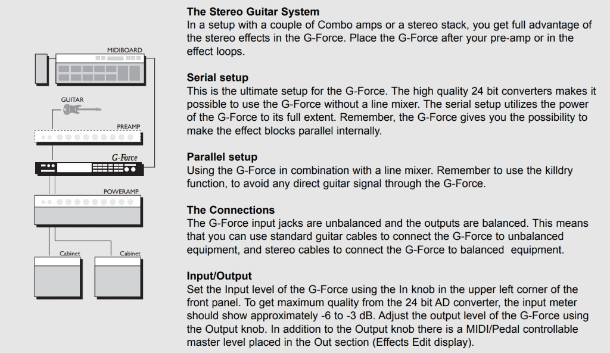

У конфігурації з кількома Combo amps або stereo stack ви отримуєте повну перевагу stereo `effects` у G-Force. Розмістіть G-Force після pre-amp або в effect loops.

### Serial setup

Це найкраща конфігурація для G-Force. Високоякісні 24-бітні конвертери дозволяють використовувати G-Force без line mixer. Serial setup використовує потужність G-Force на повну. Пам’ятайте: G-Force дає можливість робити блоки ефектів parallel внутрішньо.

### Parallel setup

Використання G-Force у поєднанні з line mixer. Пам’ятайте використовувати функцію `Killdry`, щоб уникнути прямого гітарного сигналу через G-Force.

### Підключення

Вхідні роз’єми G-Force незбалансовані, а вихідні — збалансовані. Це означає, що можна використовувати стандартні гітарні кабелі для під’єднання G-Force до незбалансованого обладнання та стереокабелі для під’єднання G-Force до збалансованого обладнання.

#### Input/Output

Встановіть Input level G-Force за допомогою ручки In у верхньому лівому куті передньої панелі. Для максимальної якості 24-бітного AD converter input meter має показувати приблизно -6 до -3 dB. Відрегулюйте Output level G-Force за допомогою ручки Output. Окрім ручки Output, є master level, яким можна керувати через `MIDI`/Pedal, розташований у секції Out (`Effects` `Edit` display).

### Моно гітарна система

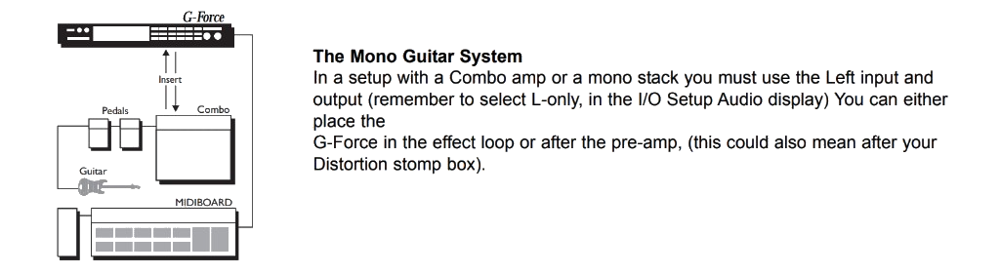

У конфігурації з Combo amp або mono stack потрібно використовувати лівий input і output (пам’ятайте вибрати L-only у дисплеї `I/O Setup` `Audio`). G-Force можна розмістити в effect loop або після pre-amp (це також може означати після вашого Distortion stomp box).

## Виклик та збереження preset

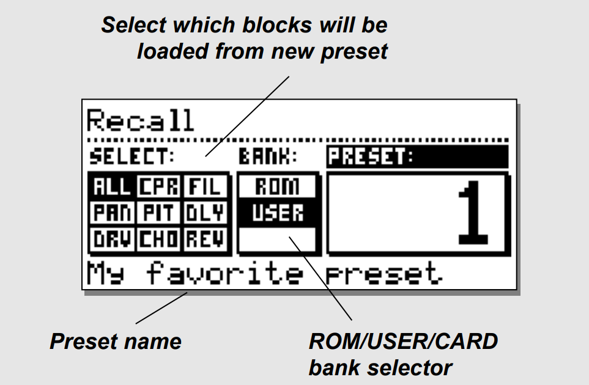

**General**

- **Select section** — використовується для вказівки певного блоку, який ви хочете викликати окремо. Має бути встановлено на «All», коли ви хочете викликати повний `preset` (налаштування за замовчуванням).
- **Bank** — використовується для вибору банку, з якого ви хочете виконати `Recall`: `ROM` (factory presets), `User` або `Card` (доступно лише при вставленій pc-`card`).
- **Preset** — обертайте `Value wheel` для попереднього перегляду presets. Натисніть `ENTER` для `Recall`.

### Виклик Preset

- Розмістіть курсор у секції «Bank» за допомогою `PARAMETER wheel`. • Виберіть банк для `Recall` за допомогою `VALUE wheel`. • Виберіть секцію «`Preset`» за допомогою `PARAMETER wheel` (див. ілюстрацію вище) • Виберіть `preset` для `Recall` за допомогою `PARAMETER wheel`. • Натисніть `ENTER`.  change  Spillover від одного `preset` до іншого можна отримати, використовуючи той самий sub-algorithm і комбінацію `Mute mode` = «`Fx In`» з `bypass` поточного блоку.

### Приклад:

Якщо ви хочете залишити хвіст `Delay` під час зміни `preset`, переконайтеся, що в обох presets використовується той самий sub-algorithm.

Крім того, слід вибрати `Mute mode` «`Fx In`» і просто `bypass` блок `Delay` у другому `preset`.

### ПРИМІТКА:

Зміна параметрів на кшталт Feedback або `Mix` під час зміни `preset` може «вбити» `Delay`.

### Оптимальна зміна preset

Оскільки перехід від одного `preset` до іншого може містити різкі зміни рівня та `Routing`, під час гри можуть виникати артефакти, якщо `preset` змінюється під час відтворення.

Для найкращої зміни `preset` під час гри слід тримати `Routing` якомога рівномірнішим.

### Приклад:

При переході від `preset` із `Reverb` і `Delay` до `preset` лише з `Reverb` слід просто `bypass` блок `Delay` замість його видалення (це також дозволить отримати spillover від блоку `Delay`)

### Виклик одного ефекту

Можна завантажити налаштування одного ефекту в існуюче `Routing`, наприклад, якщо ви створюєте новий `preset` і вам подобаються `Reverb` і `Delay`, але ви хочете додати `Chorus`, який створили минулого тижня.

Ось що робити:  Натисніть `Recall` і перемістіть курсор на параметр Select за допомогою `Parameter wheel`.

Тепер використовуйте `Value wheel`, щоб вказати на «CHO» (`Chorus`).

Перемістіть курсор назад на параметр `Preset` і використовуйте `Value wheel` для прокручування presets (не забудьте встановити банк, з якого бажаєте `Recall`).

### ПРИМІТКА:

G-Force тепер прокручуватиме лише presets, що містять потрібний ефект.

Натисніть `Enter` для `Recall` потрібного ефекту. G-Force оновить поточний `preset` новим ефектом і повернеться до поточного `preset`.

### Збереження нового User preset

- Натисніть клавішу `Store`.
- Виберіть місце для нового `preset`. (G-Force може зберігати 100 `User` presets).
- Перемістіть курсор на рядок нового імені та введіть нове ім’я `Preset` (знайдіть літеру або цифру за допомогою `Value wheel` і підтвердіть клавішею `Enter`).
- Встановіть курсор на DONE і натисніть `Enter`, щоб завершити операцію `Store`.

### Збереження з тим самим ім’ям

Якщо ви хочете зберегти відредагований Factory `preset` з тим самим ім’ям, просто натисніть `Store` і `Enter`. G-Force автоматично збереже `preset` у першому порожньому `User` space.

Якщо ви хочете зберегти відредагований `User` `preset` з тим самим ім’ям, просто натисніть `Store` і `Enter`. G-Force запропонує ту саму позицію `User` `preset` як місце збереження.

- **Bank Indicator** — індикатор банку (`ROM` / `USER` / `CARD`).
- **Store location** — місце збереження `preset`.
- **New preset name** — нове ім’я `preset`.
- **CAPS lock indicator** — індикатор регістру літер (CAP).
- **Letterbox** — розмістіть курсор на DONE і натисніть `Enter`, щоб завершити операцію `Store`.

**Letterbox**

Коли ви хочете змінити ім’я `preset` для `Store`, обертайте `Parameter wheel`. Тепер ви можете написати нове ім’я за допомогою Letterbox: обертайте `Value wheel` і натисніть `Enter`, щоб вибрати літери або цифри. Виберіть CAP, натиснувши `Enter`, щоб змінити регістр літер. Після зміни імені виберіть DONE у Letterbox і натисніть `Enter` для `Store`. Натисніть будь-яку клавішу, щоб вийти з дисплею `Store`.

### Використання memory card

Після вставлення memory `card` ви отримуєте доступ до `card` banks.

`Card` banks розташовані одразу після `User` bank.

Залежно від розміру карти можна зберегти до 9 банків по 100 `user` presets.

### Типи карт

S-RAM Type 1 PCMCIA cards, мінімум 64Kbytes і максимум 2Mbytes S-RAM.

#### Delete

Використовуйте клавіші `Arrow keys`, щоб вибрати Delete.

Обертайте `Value wheel`, щоб вибрати `preset` для видалення, і натисніть `Enter` для видалення.

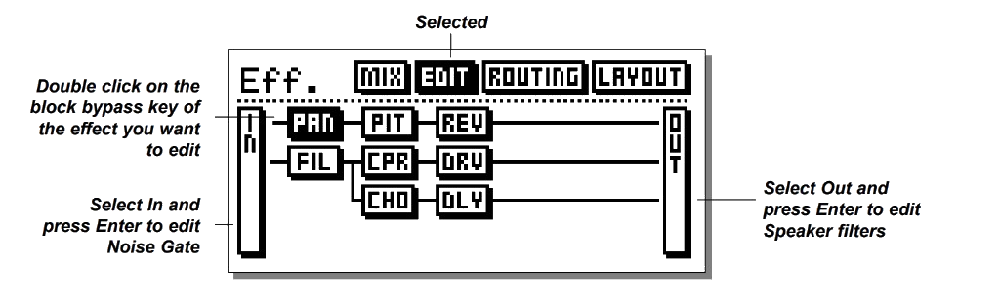

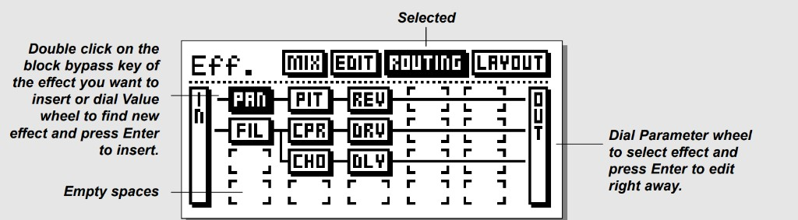

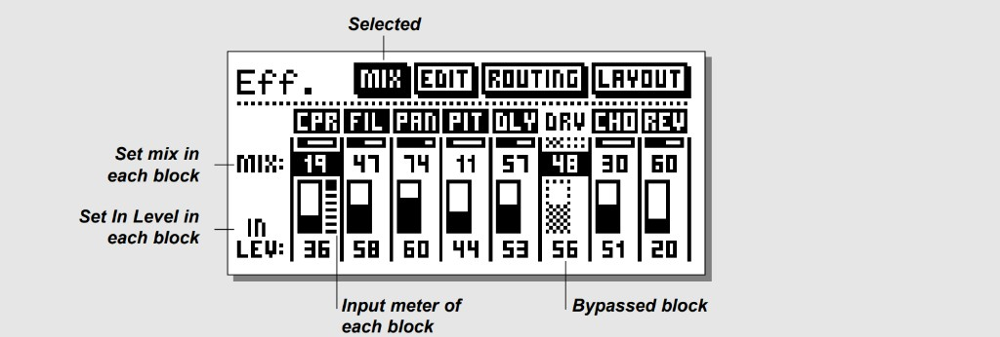

## Effects, Routing та Layout

`Editing` directly from the `Routing` display  Якщо ви хочете негайно редагувати ефект, натисніть `Enter` для доступу до дисплею `Edit` parameter.

Використовуйте `Parameter wheel` для прокручування вгору та вниз, а `Value wheel` — для зміни значень.

Натисніть `Exit`, щоб знову вийти з дисплею `Edit` parameter.

`Mix`  У дисплеї `Mix` ви можете балансувати `Mix` і In Level ефектів у цьому конкретному `preset`.

Якщо ефект `bypass`, він відображатиметься сірим, однак ви все ще можете змінювати level і `mix` цього ефекту.

Невеликий PPM показує input level кожного блоку.

Коли два сигнали з’єднуються, можливі окремі перевищення.

Індикатори кожного блоку тому розташовані безпосередньо на вході поточного блоку.

Це означає, що у разі перевантаження слід знизити level попередніх блоків.

Використовуйте `Parameter wheel` для прокручування параметрів і змінюйте значення обертанням `Value wheel`.

Натисніть `Enter`, щоб активувати поточний ефект, або `Exit` для `bypass`.

`Layout`  Окрім дисплею `Routing`, є кілька інструментів `Layout`.

Дисплей `Layout` може значно спростити певні дії.

Функції `Layout` дуже схожі на електронну таблицю. У дисплеї `Layout` ви бачите мініатюрну версію `Routing`.

Обертаючи `Value wheel`, можна змінювати позицію курсора.

Тепер обертайте `Parameter wheel`, щоб вибрати потрібну функцію.

Column  Move L - Перемістить поточний Column ліворуч.

Move R - Перемістить поточний Column праворуч.

Insert - Вставить новий Column.

Delete - Видалить поточний Column.

Row  Move U - Перемістить поточний Row вгору.

Move D - Перемістить поточний Row вниз.

Insert - Вставить новий Row.

Delete - Видалить поточний Row.

Натисніть `Enter`, щоб виконати вибрану функцію.  20  між — `Mix`, `Edit`, `Routing` і `Layout`.

За допомогою клавіш `Arrow keys` можна перемикатися між чотирма дисплеями.

Якщо ефект `bypass`, він відображатиметься без нижньої лінії.

### Редагування ефекту

Натисніть клавішу `Effects` і виберіть дисплей `Edit` (за допомогою клавіш `Arrow keys`).

Двічі натисніть block `bypass key` ефекту, який хочете редагувати, або встановіть курсор на блок і натисніть `Enter` для доступу до дисплею `Edit` parameter.

Зверніть увагу: також можна вибрати секції In і Out, наприклад `Noise Gate` розташований у секції In.

Коли ви в дисплеї `Edit` parameter, використовуйте `Parameter wheel` для прокручування параметрів і `Value wheel` для зміни значень.

Натисніть `Exit` або двічі натисніть block `bypass key`, щоб вийти з дисплею `edit` parameter.

Подвійне натискання іншого block `bypass key` переведе вас безпосередньо в дисплей `edit` parameter цього ефекту.

Changing the Sub-algorithm  У кожному блоці ефекту можна вибрати кілька варіацій поточного ефекту, наприклад у блоці `Chorus` можна вибрати між Classic `Chorus`, Advanced `Chorus`, Classic Flanger і Advanced Flanger.

Щоб змінити Sub-algorithm, увійдіть у дисплей Effect `Edit` parameter, потім використовуйте клавіші `Arrow keys` для переходу до Sub-algorithm ефекту (верхній лівий кут дисплею).

Тепер використовуйте `Parameter wheel`, щоб вибрати новий Sub-algorithm, і натисніть `Enter` для підтвердження.

`Routing`  Якщо ви хочете змінити `Routing` або порядок блоків ефектів, використовуйте клавіші `Arrow keys`, щоб вибрати дисплей `Routing`.

Використовуйте `Parameter wheel`, щоб вибрати місце для блоку ефекту, і двічі натисніть block `bypass key` ефекту, який хочете вставити, або прокручуйте ефекти за допомогою `Value wheel` і натисніть `Enter`, щоб вибрати поточний ефект.

Якщо ви просто хочете провести звук через точку, виберіть іконку pipeline.

Повна матриця `Routing` має розмір 4 на 8, і ви можете розмістити будь-який ефект (без дублювання) будь-де в матриці.

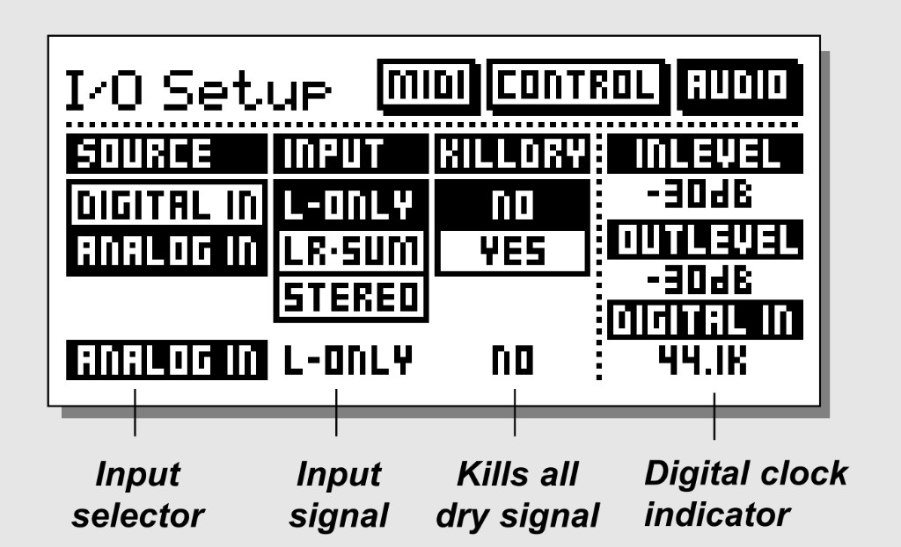

Параметри в `I/O Setup` містять налаштування всіх зовнішніх підключень G-Force:

- `MIDI`, Pedal, Digital і Analog `Audio`. У дисплеї `I/O Setup` можна вибрати `MIDI`, `Control` і `Audio` за допомогою клавіш `Arrow keys`.
- **Input selector** — вибір джерела: Digital In або Analog In.
- **Input signal** — режим входу: L-Only, LR-Sum або Stereo.
- **Killdry** — приглушує весь dry signal.
- **Digital clock indicator** — частота дискретизації digital input.

Усі налаштування `I/O Setup` є глобальними, тобто не змінюються разом із `preset`.

`Audio`  Щоб налаштувати параметри `Audio` In/Out, натисніть клавішу `I/O Setup` і використовуйте клавіші `Arrow keys`, щоб вибрати `Audio`.

#### The Source

Цим параметром можна вибрати між Digital input G-Force або Analog input. G-Force обмежений частотою дискретизації 44.1kHz на Analog і Digital inputs.

#### The Input

G-Force може використовувати лише лівий input (mono), суму лівого та правого input (LR-sum) або обидва лівий і правий input (stereo).

Якщо ви використовуєте лише один input на G-Force, слід вибрати L-Only.

Якщо ви хочете подати два mono джерела, можна вибрати LR-sum — це дозволить підсумувати лівий і правий разом  `Killdry`  Функція `Killdry` дозволяє видалити весь dry (прямий) сигнал у G-Force.

Ця функція дуже корисна, коли ви використовуєте G-Force у parallel setup.

### ПРИМІТКА:

Коли `Killdry` активний, `overall bypass` key працює як mute.

Оскільки ви прибрали весь dry signal і `bypass` ефект, виходу не буде.

Рівень блоків визначає рівень ефекту.

In Level, Out Level, Digital In  Це параметри лише для читання, що відображають Input level (регулюється елементами керування на передній панелі), Output level (регулюється елементами керування на передній панелі) та частоту дискретизації Digital input (показується лише при використанні digital input).

Note: Input level G-Force автоматично оптимізує співвідношення сигнал/шум за допомогою невеликого реле у вхідній секції.

Ви можете почути невеликий клацання від цього реле під час регулювання input.  `MIDI`  У секції `MIDI` налаштовуються параметри глобального `MIDI` в G-Force, тобто program change, `MIDI` mapping тощо.

### Basic Channel  Basic MIDI channel G-Force.

Це канал, на якому слід передавати Prg. changes для зміни presets у G-Force.

Note: Modifiers G-Force налаштовуються окремо, тобто вони можуть посилатися на інші `MIDI` channels.

Program change  Цим параметром налаштовується, як G-Force має реагувати на вхідні program changes. Є три варіанти: Disabled - G-Force ігноруватиме будь-який вхідний program change.

`Preset` `Recall` - G-Force використовуватиме program changes, надіслані на «Basic channel». + Partial `Recall` - Коли вибрано це значення, G-Force все ще реагуватиме на program changes на basic channel, але одночасно кожен із восьми блоків ефектів матиме власні `MIDI` channels, що дозволяє `Recall` окремого блоку без впливу на решту `preset`.

Номери channels блоків йдуть послідовно від Basic channel.

### Приклад:

Якщо basic channel встановлено на 1, channels блоків будуть Compress ch. 2, Filters ch. 3, Pan ch. 4 тощо.

Bank Selection  Ця функція — новий `MIDI` standard, який дозволяє `Recall` presets вище #128.

Параметр визначає, чи має G-Force реагувати на це повідомлення або використовувати цю функцію, слід вибрати Fine або Coarse. (Зверніться до посібника користувача вашого `MIDI` device/Foot Controller, щоб переконатися, який тип використовує поточний продукт).

Якщо встановлено «disabled», G-Force працюватиме як стандартний `MIDI` product.

Bank size  Bank size використовується для адаптації G-Force до різних виробників board під час `Recall` `preset` вище #128. У більшості випадків цей параметр слід встановити на 128, але в деяких випадках, наприклад при використанні Roland FC-200, слід встановити 100.

Номер bank selection, що міститься в program change, множиться на це значення, і до нього додається номер program change.

Зверніться до посібника виробника board для правильного налаштування.

### Sysex device ID  Sysex ID G-Force.

Program change offset  Цим параметром можна додавати або віднімати від вхідного Prg. change; наприклад, вхідний Prg. change — `preset` 123, а offset встановлено на +1 — Prg. change тепер буде 124.

Presets G-Force починаються з #1.

Mapping mode  Регулює, який банк має використовувати `MIDI` mapping: `ROM`, `USER`, `CARD` або Custom.

Це означає, що можна направити вхідний Prg. change на `USER` bank або створити власну `MIDI` map.

New Mapping Mode  Додано режим mapping «External».

Коли вибрано External mapping mode, усі presets у всіх банках доступні з зовнішнього `MIDI` device через controller 0 (Coarse) плюс надісланий program change відповідно до такої таблиці.

Bank Size має бути встановлено на 100, а параметр Fine/Coarse — відповідно до пристрою, що надсилає.

Обидва параметри налаштовуються в меню «`I/O Setup` - `MIDI`».

Зверніть увагу: «Coarse» має бути вибрано, коли G•Minor використовується як пристрій, що надсилає.

| Controller | Value | Призначення |
| :--- | :--- | :--- |
| 0 | 0 | `Rom` bank preset 1 to 100 |
| 0 | 1 | `Rom` bank preset 101 to 200 |
| 0 | 2 | `Rom` bank preset 201 to 225 |
| 0 | 3 | `User` bank preset 1 to 100 |
| 0 | 4 | `Card` Bank 1 preset 1 to 100 |
| 0 | 5 | `Card` Bank 2 preset 1 to 100 |
| -- | -- | -- |
| 0 | 9 | `Card` Bank 6 preset 1 to 99 |

Кількість `card` banks залежить від розміру PCMCIA `card`.

Custom Map  У Custom Map можна визначити, на що має відображатися кожен вхідний Prg. change, використовуючи параметри «Map Program Change No.» і «Into `Preset`».

### Map Program change no.

Використовуйте цей параметр, щоб вибрати Prg. change, який хочете перемапити.

Into `Preset`  Використовуйте цей параметр, щоб встановити новий пункт призначення вхідного program change.  `MIDI` Program Change Re-Transmit  G-Force може керувати повторною передачею вхідного `MIDI` prg. change.

Це дозволяє не лише перемапити вхідний program change, а й визначити, чи має поточний program change повторно передаватися на інші пристрої, що отримують `MIDI` інформацію з G-Force `MIDI` Output.

Prg. change повторно передається на роз’єм G-Force `MIDI` Out, тоді як роз’єм `MIDI` Thru передає копію сигналів, отриманих на `MIDI` In  Reset Custom Map  Розмістіть курсор на цьому параметрі і натисніть `Enter`, щоб скинути Custom map. G-Force має чотири банки, які можна використовувати для різних setups.

За допомогою `Value wheel` можна змінювати активний банк від 1 до

4. Банки миттєво зберігаються (Stored) і викликаються (Recalled), тобто будь-яка зміна в меню `Control` запам’ятовується в поточному банку та `Recall` при наступному виборі цього банку.
Кожен банк містить усі налаштування параметрів у меню `Control`.

Board factory defaults  Можна налаштувати меню `Control` для кількох board defaults.

Обертайте `Value wheel` і підтвердіть `Enter`, щоб завантажити board defaults. У списку представлені лише board з можливостями `MIDI` On/Off або Expression.

Повний список: ADA MXC   ART X-15 Ultrafoot Roland FC-200   Rocktron All Access DMC Ground `Control`   Lexicon MPX R1 Custom `Audio` Electronics RS-10   G Minor Це змінить усе налаштування `Control` на defaults обраної board, тобто перевизначить ваші налаштування.  G-Force `control`  `Main Vol`.- Керує main output volume G-Force.

`Tempo` - Використовуйте цей параметр для відстукування global `tempo` через `MIDI` або pedal input G-Force.

### Bypass

- Керує `overall bypass` G-Force.

`Tuner` - Використовуйте цей параметр для активації `Tuner`.

Modifier input  Ext. 1-8   - Ці вісім входів можуть керувати численними параметрами в алгоритмах.

Їхні функції налаштовуються в дисплеї Modifier matrix.

Це параметри, які слід налаштувати для керування expression pedals.

`Effect Bypass`  Дев’ять функцій block `bypass` можна керувати зовні через ці входи, тобто можна незалежно `bypass` кожен із дев’яти ефектів.

Деякі foot controllers на ринку можуть надсилати `MIDI` on/off messages саме для цієї мети.

Якщо у вас немає board з такими функціями, можна використати звичайний program change для `bypass` блоку, наприклад, можна налаштувати секцію Pan на `bypass` при надсиланні program change #10 на `MIDI` channel

5. Є два способи під’єднати expression pedal до G-Force.
Один — безпосередньо до роз’єму `External Control` на задній панелі G-Force.

Інший — через foot-controller, тобто як `MIDI` controller.

Щоб спростити налаштування педалі, ми розробили функцію Learn.

Розмістіть курсор на параметрі, яким хочете керувати, натисніть `Enter` для активації Learn і натисніть педаль. G-Force автоматично визначить педаль — незалежно від того, чи під’єднана вона до `MIDI`, чи до pedal jack. У кожному з наступних параметрів можна налаштувати вхід, яким має керуватися поточний параметр. У першому стовпці налаштовується джерело, у другому — тип контролера.

Опис можливостей — Column 1 Pedal:   Pedal input G-Force (див. задню панель). `MIDI` basic:   Параметр реагуватиме на basic G-Force `MIDI` channel (встановлений у `MIDI`). `MIDI` Omni: Поточний параметр реагуватиме на всі channels. `MIDI` 1-16:   Параметр реагуватиме лише на цей channel.

Column 2 (зверніть увагу: цей стовпець доступний лише коли col.1 встановлено на `MIDI`).

`Pitch` bend:   Стандартний `MIDI` `Pitch` bend.

Aftertouch:   Стандартний `MIDI` Aftertouch.

Note-on-key:   Стандартний `MIDI` Note-on.

Controller 0-127: Стандартні `MIDI` controllers. Prg.

Change:   Функція Program Change дуже особлива.

Якщо параметр налаштовано на певний Program Change, поточний параметр перемикатиметься on/off поточною зміною `preset`.

Якщо ви використовуєте Program Change на `MIDI` basic channel для керування контролером, поточний Program Change ігноруватиметься і не виконуватиме program change на G-Force.

Базовий потік внутрішніх і зовнішніх контролерів пояснюється в цьому розділі.

У G-Force є кілька входів external controller.

Це можуть бути `MIDI` controllers, `MIDI` program change, G-Force Ext. input 1/4" jack тощо.

Ці входи мають бути під’єднані до восьми віртуальних «ручок» під назвою Ext. 1-8.

Вісім «ручок» (Ext. 1-8) можна під’єднати до великої кількості параметрів алгоритмів через Modifier Matrix (див.

Matrix для деталей).

Сенс восьми «ручок» у тому, що їхні з’єднання зберігаються в presets G-Force, тобто можна використовувати ту саму педаль для різних цілей, просто змінюючи presets.

Стан цих параметрів не зберігається з `preset`: `Main vol`., `Bypass`, `Tempo` і `Tuner`. G-Force також містить кілька додаткових внутрішніх Modifiers, тобто додаткові LFO, ADRs, Envelope follower тощо.

Ці внутрішні Modifiers також присутні в Modifier matrix і можуть бути під’єднані до тих самих параметрів, що й Ext. 1-8.

Налаштування за замовчуванням параметра, під’єднаного до Modifier, дорівнює його налаштуванню в дисплеї `Edit` parameter.

### Приклад:

`Reverb` `mix` level налаштовано на керування педаллю, а параметр `Mix` у дисплеї `Edit` parameter встановлено на 15 %.

Коли цей `preset` `Recall`, `Reverb` `Mix` буде 15%, і при першому русі педалі ви повністю контролюватимете параметр.

### Setting up an Expression pedal

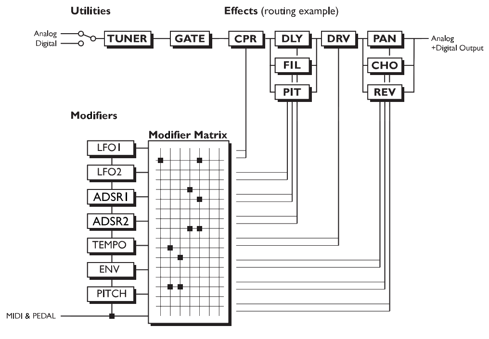

**ПРИМІТКА:** Якщо параметр не реагує правильно, спробуйте відкалібрувати педаль (див. `Utility`, Pedal Calibration).

### Приклад:

Ви хочете під’єднати expression pedal до input level блоку `Delay`: Під’єднайте expression pedal до G-Force `external control` jack на задній панелі і `Recall` `preset`, що містить `Delay`.

Натисніть клавішу `I/O Setup` і виберіть дисплей `Control`.

Використовуйте `Parameter wheel`, щоб прокрутити вниз до секції Modifier input, і розмістіть курсор на Ext. 1.

Обертайте `Value wheel`, щоб вибрати Pedal.

Тепер ви під’єднали expression pedal до однієї з восьми «ручок», тож перейдемо до підключення «ручки» до параметра.

Натисніть клавішу `MOD` і використовуйте клавіші `Arrow keys`, щоб вибрати Matrix.

Використовуйте `Value wheel` для горизонтального прокручування, доки не побачите Ext. 1 (ваша педаль) у верхньому рядку.

Тепер використовуйте `Parameter wheel` для вертикального прокручування, доки не побачите `Delay` Inlevel.

Натисніть `Enter`, щоб з’єднати Ext. 1 з `Delay` In Level.

### ПРИМІТКА:

Якщо параметр не реагує правильно, спробуйте відкалібрувати педаль (див.

### Utility, Pedal Calibration).

Коли два рядки з’єднані (тобто Ext.1 під’єднано до Tremolo speed), можна створити перетворення між двома рядками.

Перемістіть курсор на точку, що з’єднує два рядки, і натисніть `Enter`, щоб увійти в дисплей Link.

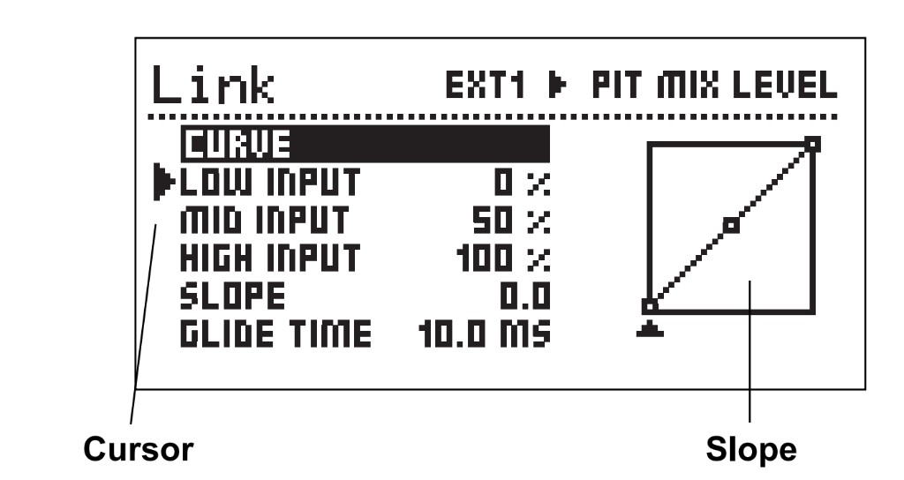

У дисплеї Link можна змінити криву між Modifier і фактичним рухом поточного параметра.

Low input  Використовуйте цей параметр для регулювання мінімального значення modifier, тобто коли expression pedal у мінімальному положенні.

Mid input  Використовуйте цей параметр для регулювання середнього значення modifier, тобто коли expression pedal у середньому положенні.

High input  Використовуйте цей параметр для регулювання максимального значення modifier, тобто коли expression pedal у максимальному положенні.

### ПРИМІТКА:

Ці самі параметри transform застосовуються до інших джерел модуляції, наприклад Envelope: Low — коли вхідний сигнал у G-Force найнижчий, і High — коли найгучніший.

Slope  Обертайте параметр Slope, щоб змінити форму кривої.

Спробуйте і спостерігайте, як змінюється крива.

Cursor   Connection Point   Parameter List Matrix — це місце, де ви під’єднуєте зовнішні педалі (налаштовані в `I/O Setup`, Ext.

Input) або внутрішні Modifiers до параметрів, якими хочете керувати.

Обертайте `Parameter wheel` для вертикального переміщення курсора і `Value wheel` — для горизонтального.

Натисніть `Enter`, щоб з’єднати два рядки.

Натисніть `Exit`, щоб видалити з’єднання.

Основна ідея: у верхньому рядку Matrix є кілька Modifiers (додаткові LFO, ADSRs, ENV і ваші Ext.

### Inputs).

Праворуч у Matrix — список параметрів, доступних у поточному `preset`.

Це означає, що ефект має бути присутнім у `preset`, перш ніж він з’явиться в списку параметрів.

Не всі параметри ефекту доступні.

Щоб під’єднати Modifier до параметра, перемістіть курсор на точку перетину їхніх рядків і натисніть `Enter`.

### Приклад:

Ви хочете, щоб LFO1 модуляував speed Tremolo (переконайтеся, що Tremolo є в поточному `preset`).

Тепер перемістіть курсор горизонтально, обертаючи `Value wheel`, доки курсор не опиниться безпосередньо під LFO1.

Наступний крок — знайти Tremolo speed.

Обертайте `Parameter wheel`, доки не дійдете до точки перетину Tremolo speed і LFO1, і натисніть `Enter`.

Маленька крапка вказує, що LFO і Tremolo speed з’єднані.

Це дисплей, де налаштовуються параметри внутрішніх modifiers.

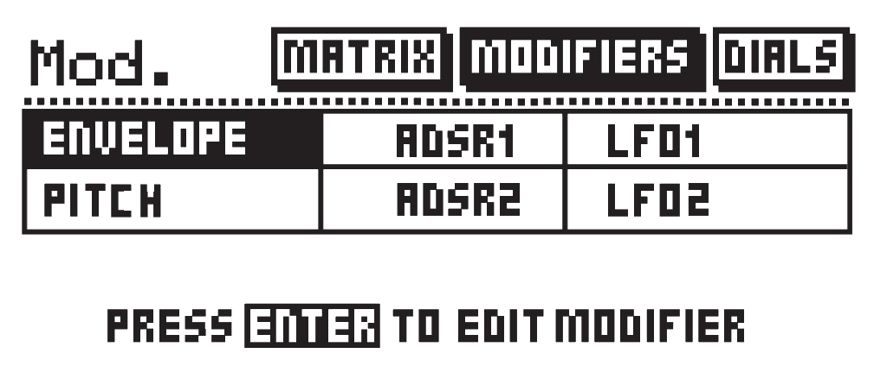

Використовуйте `Parameter wheel`, щоб вибрати modifier для редагування, і натисніть `Enter` для доступу до параметрів поточного modifier.

Нижче — пояснення параметрів у Modifiers.

Envelope Follower  Envelope follower використовується на ефектах, які мають реагувати на вхідний сигнал, наприклад touch-wah або dynamic `delay`.

Envelope follower виконуватиме той самий динамічний рух, що й input, але можна змінити час відгуку за допомогою Attack і Release.

### Attack

- Встановлює час до того, як ENV відреагує на вхідний сигнал.

### Release

- Час, протягом якого ENV продовжує працювати після зупинки вхідного сигналу.

`Pitch`  Для оптимальної точності `Pitch` detection у G-Force потрібно встановити найкращий відповідний діапазон відповідно до інструмента, на якому ви граєте.

Виберіть між: 6s GTR D-E   Налаштування за замовчуванням для 6-string guitar.

Також приймає поширений dropped D tuning. 7s GTR A-E   Використовуйте це tuning для 7-string guitar. G-Force реагує на ноти аж до A.

Однак точність у такому низькому діапазоні може відрізнятися залежно від типу гітарної конфігурації. 4s Bass D-E   Відповідає діапазону 4-string bass.

Цим параметром можна встановити мінімальний час, за який параметр має перейти від максимуму до мінімуму або навпаки, тобто навіть якщо ви перемістите expression pedal від min. до max. за частку секунди, поточний параметр все одно витратить певний час на проходження того самого діапазону.

Натисніть `Exit`, щоб вийти з дисплею Link.

Кожен modifier можна під’єднати до кількох параметрів одночасно, але кожен параметр може мати лише одне джерело.

Максимальна кількість з’єднань у matrix — 20.

Default parameter setting  Налаштування за замовчуванням параметра, під’єднаного до Matrix, при `Recall` дорівнює його налаштуванню в дисплеї `Edit` parameter.

### Приклад:

`Reverb` `mix` level налаштовано на керування педаллю, а параметр `Mix` у дисплеї `Edit` parameter встановлено на 15 %.

Коли цей `preset` `Recall`, `Reverb` `Mix` буде 15%, і при першому русі педалі ви повністю контролюватимете параметр.

Якщо хочете видалити всі зв’язки Matrix, натисніть `Exit` двічі — з’явиться спливаюче вікно з проханням підтвердити `Enter` або скасувати `Exit`.

## I/O Setup та MIDI

ADSR використовуються для відтворення коротких послідовностей, що запускаються вхідним аудіосигналом.

Ви налаштовуєте кілька термінів, що описують поточну послідовність, і trigger level, також відомий як Threshold.

Attack  Attack або rise time кривої, тобто скільки часу потрібно для переходу від мінімального до максимального рівня.

Decay  Встановлює, скільки часу потрібно кривій, щоб впасти від максимуму до рівня Sustain.

Sustain  Час, протягом якого ADSR утримуватиме рівень Sustain.

Sustain level  Значення, що надсилатиметься під час періоду Sustain.

Release  Час, за який ADSR падає від рівня Sustain до нуля.

Release time бере верх, коли час Sustain минув (залежно від налаштування trig mode).

Mode  Параметром mode можна вибрати спосіб реакції ADSR на trigs.

Загалом ADSR може retrig лише якщо сигнал падає нижче threshold і знову піднімається. Once

- Запустить ADSR до кінця один раз, після чого буде готовий до нового trig. У режимі «Once» сигнал має впасти нижче threshold після завершення ADSR, щоб можна було retrig.

### Once-Retrig

- Запустить ADSR до кінця один раз, але може retrigger під час послідовності ADSR.

Loop

- Продовжуватиме запускати послідовність ADSR, поки сигнал залишається вище threshold.

### Loop-Retrig

- Продовжуватиме запускати послідовність ADSR, поки сигнал залишається вище threshold, але може retrigger  Sustain
- Залишатиметься на рівні Sustain, поки сигнал залишається вище threshold.

### Sust-Retrig

- Залишатиметься на рівні Sustain, поки сигнал залишається вище threshold, але може retrigger під час послідовності ADSR.

Threshold  Коли input level перевищує цей рівень, ADSR запускається.  LFO 1&2  LFO можна використовувати для різних цілей, наприклад під’єднати balance parameter і створити додатковий panner або модуляувати filter для auto-wah ефекту. LFO1 і LFO2 мають два виходи, тобто можна використовувати той самий LFO з різною фазою для різних цілей.

### Speed

- Швидкість LFO, також відома як Rate.

### Depth

- Глибина LFO, також відома як Width.

### Tempo

- Встановлює зв’язок швидкостей LFO з відстуканим `tempo` (клавіша `Tempo`).

Доступні підрозділи: Ignored1/1, 1/2- 1/32, straight, dotted або triplets.(1/4 дорівнює BPM (beats per minute).

### Curve

- Виберіть криву для поточного LFO.

Вибір між: Square, Sine і Triangle.

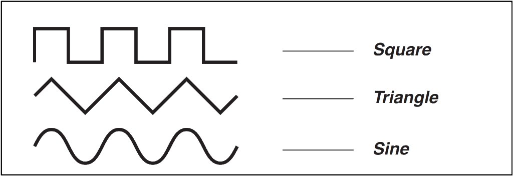

### Pulsewidth

- Керує поділом верхньої та нижньої частин поточної кривої, тобто якщо Pulsewidth встановлено на 75%, верхня половина кривої буде увімкнена 75% часу.

Out2 phase - Зміна фази LFO спричиняє невелику затримку початкової точки другої форми хвилі.

Це означає, що out 1 і 2 починають поточну форму хвилі у двох різних точках.

### Приклад:

Якщо Out2 phase встановлено на 180 degrees, Out 1 і 2 будуть точно протилежними.

### Dials

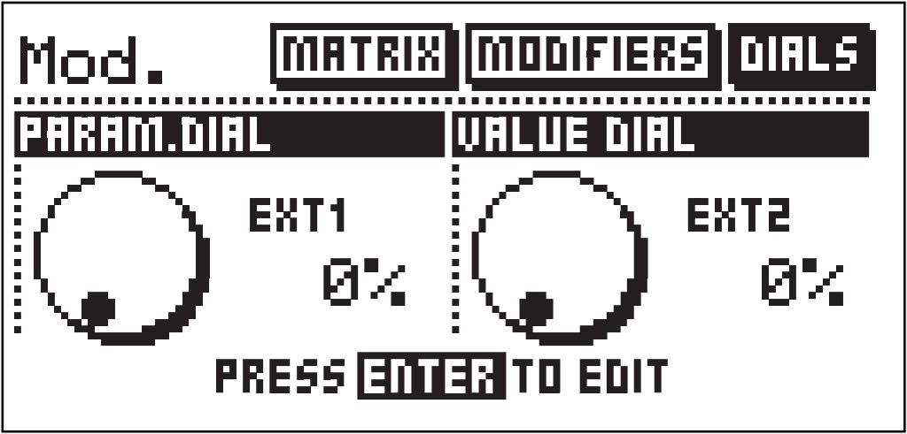

Натисніть клавішу `Mod` і використовуйте клавіші `Arrow keys`, щоб вибрати Dials.

Основна ідея Dials полягає в тому, що можна імітувати будь-який із восьми External controllers за допомогою Parameter і `Value wheel`.

Обертаючи, можна перевірити, чи правильно реагують зв’язки в Matrix без під’єднаної педалі.

Якщо хочете переконатися, що expression pedal відкалібрована правильно, можна перевірити, спостерігаючи за dials під час руху педалі від 0 до 100%.

Натисніть `Enter`, щоб змінити External controllers, які імітують колеса.

Використовуйте `Parameter wheel` для вибору між Dial 1 або 2 і натисніть `Exit`, коли встановите потрібні external controllers для імітації.

### Pulsewidth   і Billboard.

Використовуйте клавіші `Arrow keys` для вибору між двома дисплеями.

#### Config

У дисплеї Config можна налаштувати кілька глобальних параметрів для G-Force, наприклад memory protect, backup `User` bank тощо.

**Utility**

| Розділ | Параметри |
| :--- | :--- |
| **User Interaction** | Display viewing angle, Parameter Dial Direction |
| **Preset Change** | Effect Muting, Extern Modifier Input |
| **Environment** | Pedal Type, Pedal Calibration, Pedal Curve, `Tuner` `MIDI` Out |
| **User bank protect** | Protect, Protect Lo-limit, Protect Hi-limit |
| **User bank backup** | `User` bank to `Card`, `Card` to `User` bank, `User` bank to `MIDI`, `MIDI` to `User` Bank |

Display Viewing Angle Регулювання для найкращого контрасту LCD display.

Parameter dial direction FWD - UP/DOWN: Вибір напрямку, в якому `Parameter wheel` переміщує курсор дисплею.

`Preset` Change  Effect mute On Коли встановлено on, G-Force заглушує звук на дуже короткий момент під час зміни `preset`.

Ця функція дозволяє уникнути будь-яких артефактів під час зміни presets.

Effect mute Off Коли effect mute встановлено off, G-Force `bypass` блоки ефектів відповідно до `Mute mode`, встановленого в кожному блоці, під час зміни `preset`.

### Приклад:

`Preset` 1 містить `Delay`.

`Mute mode` `Delay` встановлено на «FX Input».

Оскільки «FX Input» утримує dry signal на рівні, встановленому параметром `Mix` блоку, цей `preset` робитиме те саме. (`Mute mode` пояснюється в розділі «Blocks»).

Щоб уникнути стрибків рівня під час зміни `preset`, ретельно продумайте `Mute mode` кожного блоку. «`Mix` 0%» підніме рівень прямого сигналу до 100% в момент зміни `preset`. «`FX In`/Out» утримуватиме рівень прямого сигналу під час зміни `preset`.

Extern Modifier Input Ця функція визначає, як зовнішньо керовані параметри мають реагувати під час зміни `preset`.

Reset - Встановить керований параметр на значення, збережене в `preset`.

При першому русі External controller параметр буде «захоплено».

Preserve - Збереже значення external controller, тобто керований параметр почне з цього значення.

### Приклад:

Ви збираєтеся завантажити `preset` із зовнішньою expression pedal, що керує параметром `Delay` `mix`.

Параметр `Delay` `mix` збережено на 50%.

Тепер ви завантажуєте цей `preset`.

Якщо вибрано «Reset» в Ext. modifier input, `Delay` `mix` буде скинуто до значення `preset` = 50% Якщо вибрано «Preserve» в Ext. modifier input, `Delay` `mix` збереже значення педалі = 100%.

Environment  Pedal Type Перемикає між momentary і alternating.

Цей параметр слід встановити на alternating, якщо ви використовуєте expression pedal.

Pedal Calibration Натисніть `Enter`, щоб увімкнути калібрування External input jack на задній панелі G-Force.

Дотримуйтесь інструкцій на дисплеї.

Pedal Curve Криву відгуку External 1/4" jack Input тепер можна регулювати.

Після калібрування External Input виберіть «Pedal Curve» в «`Utility` - Config display» і натисніть `ENTER`.

Використовуйте `VALUE wheel` для зміни response curve.

Натисніть `EXIT`, щоб вийти з дисплею «Pedal Curve».

Параметр «Pedal Curve» є глобальним і тому не змінюється разом із presets.

`Tuner` `MIDI` Out У меню `Utility` додано параметр `Tuner` `MIDI` Out.

Цей параметр слід встановити на «On», щоб використовувати функцію `Tuner`-display у під’єднаній педалі G•Minor.

Параметр `Tuner` `MIDI` Out ОБОВ’ЯЗКОВО має бути Off під час виконання `MIDI` Bulk dump.

Якщо `MIDI` Out під’єднано до іншого пристрою, ніж G-Minor, може бути доцільно використовувати положення «off», щоб уникнути надсилання непотрібної `MIDI` інформації на той пристрій.

`User` Bank Protect  Protect Встановлює функцію Protect On/Off.

Protect Low limit Встановлює нижню межу `preset` protect.

Поточний номер включено в protect.

Protect High limit Встановлює верхню межу `preset` protect.

Поточний номер включено в protect.

`User` Bank Backup  Цими функціями можна створити backup `User` presets G-Force на `card` або `MIDI` recording device.

### Card type: SRAM PCMCIA, type 1, min. 64 K byte.

Залежно від розміру PCMCIA `card` на одній `card` доступно кілька banks.

`User` Bank to `Card` Вставте PC-`card` у `Card slot` і двічі натисніть `Enter`.

Усі `User` presets G-Force буде збережено на memory `card`.

`Card` to `User` bank Вставте PC-`card` із вашими presets і двічі натисніть `Enter`.

Усі presets тепер буде збережено назад у `User` bank G-Force.

### УВАГА:

Ця дія перезапише ВСІ `User` presets.

`User` bank to `MIDI` Під’єднайте `MIDI` out G-Force до іншого G-Force, sequencer або будь-якого іншого `MIDI` recordable device.

Двічі натисніть `Enter`, і G-Force виконає `MIDI` bulk dump усіх `User` presets. Під’єднайте пристрій збереження до `MIDI` In G-Force і натисніть `Enter`. G-Force тепер готовий прийняти `MIDI` bulk dump із `User` presets.

### УВАГА:

Ця дія перезапише ВСІ `User` presets.

#### Billboard

У дисплеї `Billboard` можна налаштувати кілька параметрів для `Billboard`.

**Billboard**

| Розділ | Параметри |
| :--- | :--- |
| **Scrolling** | Speed, Activity |
| **Activity** | `Preset` change, Always show `tuner`, Run message |
| **Message string** | `Edit` message |

**Scrolling**

Speed Встановлює швидкість прокручування `Billboard`.

Activity G-Force містить глобальне повідомлення, яке завжди можна показувати або використовувати як screensaver. Цей параметр визначає, як часто активне Global message.

**Activity**

`Preset` change Встановлює дію, яку `Billboard` виконуватиме під час зміни presets.

Можна вибрати між ковзанням і прокручуванням імені та номера поточного `preset`.

Always show `Tuner` Якщо цей параметр активний, `Billboard` завжди показуватиме ноту `Tuner` і індикатори.

Цей параметр також можна встановити з дисплею `Tuner`.

**Message string**

`Edit` message Натисніть `Enter` при виборі цього параметра, щоб змінити текст глобального повідомлення.

Виберіть DONE і натисніть `Enter` для завершення.

## Tempo

Встановіть глобальний `tempo`, натискаючи клавішу `Tempo`.

Глобальний `tempo` можна використовувати як спільний `tempo` guide у всіх `preset`.

Усі алгоритми `Delay` і всі алгоритми, що містять speed, можуть використовувати глобальний `tempo`.

Введення `tempo` натисканням у `Delay`  Усі параметри `Delay` і Speed пов’язані з меню Global `Tempo`.

Це означає, що введений натисканням `tempo` можна використовувати в будь-яких `preset`, які мають ці параметри.

Щоб `tempo` відповідав вашим потребам, ми додали subdivision у всі ці алгоритми.

Усе, що вам потрібно зробити, — налаштувати, на який параметр subdivision ви хочете поділити `tempo`.

### Приклад:

Ви хочете, щоб `Delay` відтворював 1/8 triplets.

Перейдіть на сторінку `Edit` parameter `Delay` і виберіть 1/8 T.

Тепер ви можете просто натиснути BPM на клавіші `Tempo` (або через pedal), і `Delay` автоматично перерахує значення у 1/8 triplets у поточному `tempo`.

Те саме стосується всіх алгоритмів, що містять Speed.

Алгоритми, які можуть використовувати глобальний `tempo`: `Delay` `Chorus` Flanger Phaser Tremolo Panner і modifiers LFO 1 LFO 2.

### Tempo display

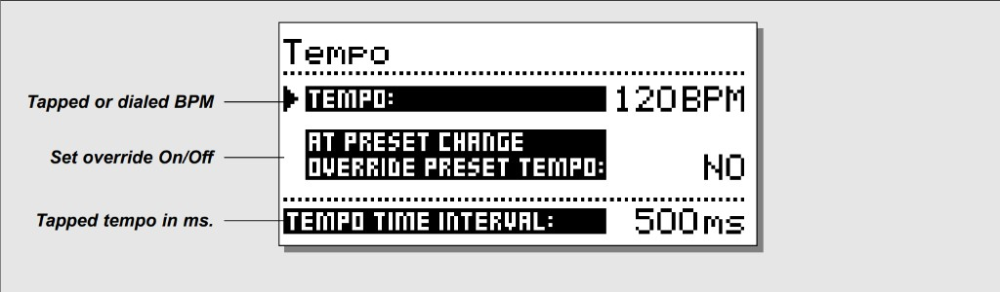

- **TEMPO** — введений натисканням або встановлений BPM.
- **AT PRESET CHANGE OVERRIDE PRESET TEMPO** — увімкнення/вимкнення override.
- **TEMPO TIME INTERVAL** — tempo натисканням у мс.

Натискання клавіші `Tempo` відкриває `Tempo` display, а `Billboard` блиматиме в поточному `tempo`. І `Tempo` display, і блимаючий `Billboard` зникнуть автоматично через кілька секунд. У `Tempo` display ви можете бачити введений натисканням BPM (Beats per minute) або встановити BPM, поставивши курсор на `Tempo` і обертаючи `Value Wheel`.

Максимальний `tempo` — 300 BPM.

Мінімальний `tempo` — 20 BPM.

Override `preset` `tempo` at `preset` change  Керує тим, чи має `tempo` змінюватися миттєво під час зміни `preset`, чи новий `preset` має чекати на наступний введений натисканням `tempo`.

### Приклад:

Ви використовуєте `preset` із прямим `delay` 1/4 note, і ви ввели `tempo` в G-Force, припустимо 120 BPM, тобто ви встановили Global `Tempo` 500 ms.

Тепер ви змінюєте `preset`, і новий `preset` має використовувати 1/8 triplets.

Ви хочете, щоб `preset` одразу використовував існуючий `tempo`, чи щоб `preset` чекав на наступний введений натисканням `tempo`?

Вибір Yes дозволить `preset` використовувати `tempo` миттєво під час зміни `preset`.

`Tempo` controlled via pedal/`MIDI`  `Tempo` можна вводити натисканням через роз’єм External input на задній панелі G-Force або через `MIDI` On/Off switch.

Це налаштовується в `I/O Setup`, `control` display.

## Tuner

### Tuner display

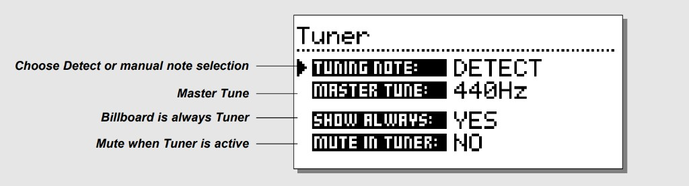

- **TUNING NOTE** — вибір Detect або ручного вибору ноти.
- **MASTER TUNE** — Master Tune.
- **SHOW ALWAYS** — `Billboard` завжди показує `Tuner`.
- **MUTE IN TUNER** — заглушення, коли `Tuner` активний.

Натискання клавіші `Tuner` відкриває `Tuner` display. У `Tuner` display є чотири параметри налаштування.

Вхід у `Tuner` display також активує `Tuner` guides на `Billboard` і на gain reduction `meters`.

Tuning Note  За допомогою цього параметра ви можете вибрати режим Detect або вручну вказати ноту, яку хочете налаштувати.

Коли `tuner` встановлено на Detect, він автоматично визначає, яку ноту ви граєте.

Це відображається на `Billboard` разом із двома стрілками, які показують, чи ви трохи flat або sharp.

Одночасно gain reduction `meters` показують, наскільки ви розладені.

Коли світяться дві центральні LED, ви налаштовані точно.

Master tune  За допомогою параметра Master tune ви можете відкалібрувати `tuner`.

Примітка: Master Tune керує `pitch` detector, тобто налаштування `Pitch` voices змінюватимуться разом із Master tune.

Show always  Коли “Show Always” увімкнено, `Billboard` постійно показуватиме `Tuner`.

Це дозволяє вам у будь-який момент обернутися і перевірити, чи ви налаштовані.

Цей параметр також доступний у `Utility`.

Mute in `Tuner`  Цей параметр дозволяє заглушити виходи G-Force, коли `Tuner` активовано.

Це означає, що ви можете налаштовувати гітару на сцені без жодного звуку.

Звук буде заглушено лише поки активний `tuner` display.

`Tuner` activated via pedal/`MIDI`  `Tuner` можна активувати через роз’єм External input на задній панелі G-Force або через `MIDI`.

Це налаштовується в `I/O Setup`, `Control` display.

## Блоки ефектів

У цьому розділі розглянуто всі параметри `Edit` у восьми блоках, а також у секціях Input і Output.

`Mute mode`  Усі вісім effect blocks мають кілька різних Mute modes.

Вони розташовані як останній параметр у списку `Edit` кожного блоку.

Ідея полягає в тому, що ви можете вирішити, як кожен окремий блок має реагувати, коли ви натискаєте `bypass key` поточного блоку на передній панелі.

Ось опис того, що робитимуть п’ять режимів під час `bypass`: `Mix` 0%: Заглушить вихід effect і підніме рівень direct signal до 100% dry = 0% effect. FX Out: Заглушить вихід effect і збереже рівень direct signal відповідно до `Mix`.

Output: Заглушить і вихід effect, і direct signal. `FX In`: Заглушить вхід effect і збереже рівень direct signal.

Це дозволяє блоку завершити effect tail після `bypass`, наприклад, якщо використати цей `mute mode` на `delay`, `delay` tail продовжить звучати навіть після `bypass` або під час зміни `preset` між двома `preset` з однаковими налаштуваннями (лише `Delay`, `Reverb` і `Pitch` мають цей `mute mode`).

Input: Заглушить і вхід effect, і direct signal.

Та сама базова функція, що й `FX In`, лише цей режим також заглушить direct signal. (лише `Delay`, `Reverb` і `Pitch` мають цей `mute mode`).

Використання `Input/Output` mute modes означає, що під час `bypass` через поточний блок не проходить жодного сигналу.

### Noise gate

Базова ідея Gate полягає в тому, що коли вхідний сигнал падає нижче threshold, який ви встановили, Gate знижує сигнал на певну кількість dB, також встановлену вами.

### Приклад:

Ви встановлюєте Threshold на -25dB і Max. damping на 30dB.

Коли ви подаєте сигнал у G-Force, Gate нічого не робить, але коли вхідний сигнал нижчий за -25dB (на input meter), Gate починає приглушувати до максимуму 30dB (див. Noise Gate meter). Швидкість приглушування встановлюється параметром Release rate (Rel.rate).

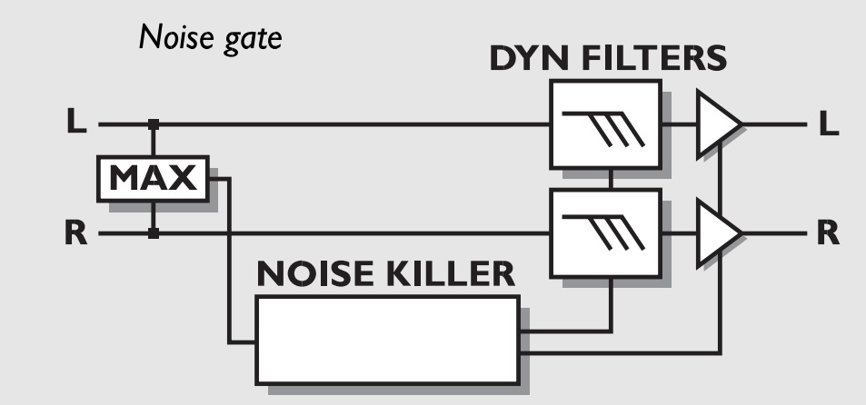

У In-section G-Force знаходиться `Noise Gate`.

Gain reduction `Noise Gate` відображається LED під `Billboard`.

`Noise Gate` (включно з параметром Level) не обходиться загальною клавішею `Bypass`.

Це означає, що `Noise Gate` залишатиметься активним, навіть якщо ви обійдете всі effect G-Force.

#### NOISE GATE

Mode  За допомогою mode selector ви можете вибрати між Hard і Soft Gating.

Hard приглушує майже миттєво, коли Input падає нижче Threshold, тоді як Soft приглушує поступово, тобто дуже плавно і м’яко, не руйнуючи sustain.

Threshold  Коли вхідний рівень падає нижче цього Threshold, `Noise Gate` активується. Max.

Damping  Максимальна кількість dB, на яку `Noise Gate` може приглушити (також називається gain reduction), тобто якщо Max.

Damping встановлено на 0 dB, `Noise Gate` взагалі не приглушуватиме.

Damping/Gain reduction відображається на `meters` під `Billboard`. Release rate встановлює швидкість, з якою `Noise Gate` приглушує, тобто якщо параметр встановлено на 100dB pr. second, `Noise Gate` приглушуватиме дуже швидко.

Level  Цей level `control` можна використовувати для керування In Level у різних `preset`.

Встановивши Level на -6dB у всіх ваших базових `preset`, ви залишаєте трохи додаткового рівня для lead `preset`.

Параметр Level також є в Modifier Matrix і тому може керуватися через pedal або `MIDI`.

`Compressor`  `Compressor` призначений для зменшення динамічного вмісту вхідного сигналу і тим самим підтримки більш сталого рівня.

Коли вхідний сигнал перевищує threshold, `Compressor` починає зменшувати сигнал відповідно до Ratio.

Ratio описує, наскільки зменшується сигнал, наприклад Ratio 2:1 означає, що за кожні 2 dB перевищення threshold на виході лише 1 dB.

Коли сигнал падає нижче Threshold, `Compressor` має припинити роботу, але параметр Release може уповільнити цей процес.

Параметр Release визначає, як довго `Compressor` має продовжувати працювати після того, як сигнал опустився нижче Threshold.

### Приклад:

`Compressor` встановлено на Ratio 8:1, і сигнал перевищує Threshold на 16dB — це дасть gain reduction 14dB (видно на `Compressor` gain reduction meter).

Release time встановлено на 28 dB/S.

Це означає, що коли сигнал падає нижче Threshold, `Compressor` повернеться до відсутності gain reduction за 0.5 секунди.

`Compressor` у G-Force доступний у простій і розширеній версіях.

`Compressor` використовує auto-makeup-gain.

Це означає, що `Compressor` автоматично компенсує втрату рівня, спричинену gain reduction, підвищуючи outlevel, тобто чим сильніше ви стискаєте, тим вищий рівень отримуєте на виході.

Attack time масштабується автоматично залежно від динамічного вмісту вхідного сигналу.

#### COMPRESSOR

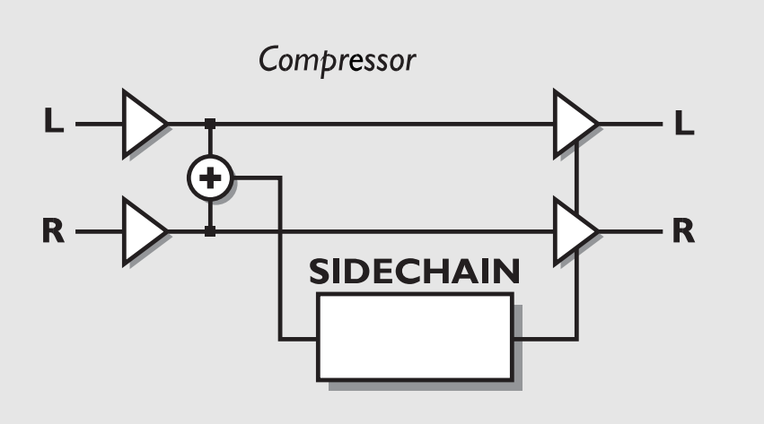

Threshold Коли вхідний рівень перевищує Threshold, `Compressor` активується.

Це означає, що чим нижчий Threshold, тим більше compression ви отримаєте.

Ratio  Ratio впливає на крутизну `Compressor`.

### Приклад:

Коли Ratio встановлено на 2:1, це означає, що за кожні 2dB зростання вхідного рівня вихідний рівень збільшується на 1 dB.

Knee Mode   (only in advanced)  Параметр Knee Mode встановлює точку згину `compressor` на soft knee або hard knee.

Коли вибрано soft knee, `Compressor` поступово досягає ratio, тоді як hard knee змушує `Compressor` переходити безпосередньо від відсутності compression до поточного ratio.

Release   (only in advanced)  Release встановлює час повернення `Compressor` після того, як сигнал опустився нижче Threshold, тобто якщо `Compressor` зменшує gain на 14dB, а Release встановлено на 28dB/S, знадобиться 0.5 секунди, перш ніж `Compressor` припинить gain reduction.

In Level  Керує вхідним рівнем блоку.

Out Level  Керує вихідним рівнем блоку `Compressor`.

Filters  Блок Filter містить п’ять різних sub-algorithms: Parametric EQ, Wah Wah, Formant, Resonance і Phaser.

Ці п’ять алгоритмів виконують кілька effect у діапазоні від тонких до екстравагантних. Parametric EQ містить два shelving filters (#1 і #5) і три bell filters (#2, #3, #4).

Low shelving filter — це фільтр, який працює від певної target frequency і вниз, тобто все нижче target frequency буде скориговано.

High shelving filter аналогічний low shelving, але тепер коригуються всі частоти вище target.

Bell filter — це фільтр, який працює навколо target.

Це означає, що певна кількість сусідніх частот буде скоригована.

Кількість сусідніх частот, на які впливає фільтр, регулюється параметром BW (bandwidth).

#### PARAMETRIC EQ

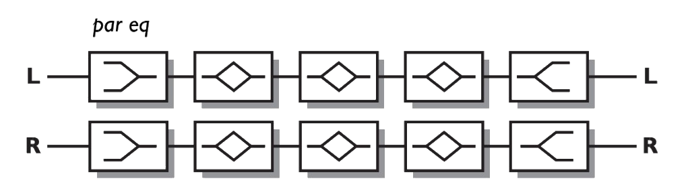

Freq Використовуйте параметр freq, щоб встановити target frequency поточної смуги.

Slope/BW (bandwidth)  Використовуйте параметр Slope, щоб налаштувати крутизну shelving filter.

Bandwidth регулює, наскільки широкими є bell filters.

Gain  Використовуйте gain, щоб підсилити або ослабити target frequency.

Усі фільтри можуть підсилювати або ослаблювати +/-12dB.

In Level  Керує вхідним рівнем блоку.

Out Level  Керує вихідним рівнем блоку. `Mute mode`  Див.

`Mute mode` у вступі цього розділу.

Resonance filters по суті є high і low cut filter, які можна переміщувати вгору й вниз по частотному діапазону.

Коли параметр Resonance (Q-factor) збільшується, пік фільтра на cutoff frequency стає дуже вузьким і дуже крутим.

Саме це лежить в основі характерного звучання Resonance filters.

### ПРИМІТКА:

Пік фільтрів може стати дуже гучним і легко досягти internal ceiling, спричиняючи distortion.

Щоб уникнути цього, зменшіть input level блоку Filter.

#### RESONANCE

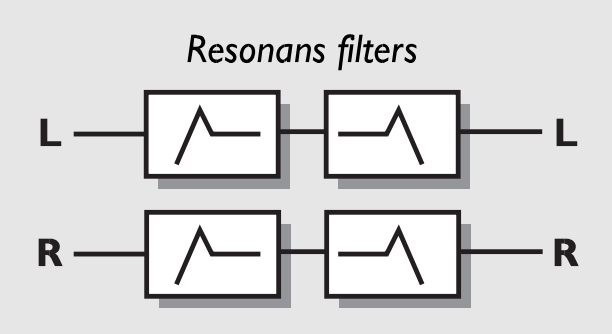

Order Параметр Order фільтрів resonance змінює крутизну фільтрів. 2nd order filters — це 12dB/Octave, тоді як 4th order — 24dB/Octave. 4th order filters “дзвенітимуть” або резонуватимуть сильніше, ніж 2nd order filters.

Locut freq  Встановлює частоту Locut resonance filter.

Hicut Freq  Встановлює частоту Hicut resonance filter.

Lo Resonance  Встановлює кількість resonance на Locut filter.

Hi Resonance  Встановлює кількість resonance на Hicut filter.

Спробуйте під’єднати LFO або expression pedal до двох frequency parameters через Modifier Matrix.

### Mix  Mix між direct sound і effect.

In Level  Керує вхідним рівнем блоку. Керує вихідним рівнем блоку. `Mute mode`  Див.

`Mute mode` у вступі цього розділу.

### Wah Wah

#### WAH WAH

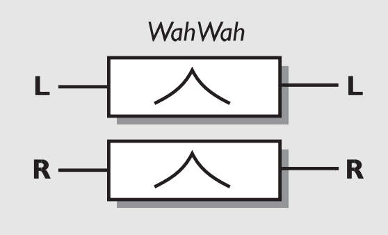

Freq Частота Wah Wah.

Під’єднайте цей параметр до LFO, ENV або expression pedal, і ви отримаєте Autowah, Touchwah або Manual Wah.

Instrument mode  Цей параметр змінює діапазон Wah Wah між guitar і bass ranges.

### Mix  Mix між direct sound і effect.

In Level  Керує вхідним рівнем блоку.

Out Level  Керує вихідним рівнем блоку. `Mute mode`  Див.

`Mute mode` у вступі цього розділу.

Formant filters  Formant filters дещо особливі.

Вони можуть створити для вас новий звук.

Уявіть pedal, який не каже WAH WAH, а натомість видає OOWEE-OOWEE.

Formants також відомі як голосні звуки людської мови.

Базова ідея полягає в тому, що ви встановлюєте три координати — Start, Thru і End — у частотній області, а потім переміщуєте свій звук вгору й вниз по кривій, яку створили цими координатами.

#### FORMANT CURVE

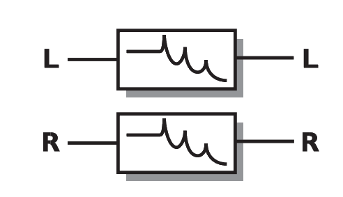

Start Початкова точка formant curve.

Thru  Точка Thru кривої  End  Кінцева точка кривої  Resonance  Встановлює кількість resonance на Formant filter.

Age/Sex  Використовується для зміни характеру formant curve.

Спробуйте трохи поекспериментувати з цим параметром.

Sweep  Обертайте параметр Sweep, щоб рухатися вгору й вниз по formant curve.

Саме цей параметр варто під’єднати до pedal або іншого modifier.

Спробуйте під’єднати параметр Sweep до LFO, ENV або expression pedal для realtime parameter `control`.

### Mix  Mix між direct sound і effect.

In Level  Керує вхідним рівнем блоку.

Out Level  Керує вихідним рівнем блоку. `Mute mode`  Див.

`Mute mode` у вступі цього розділу.

#### PHASER

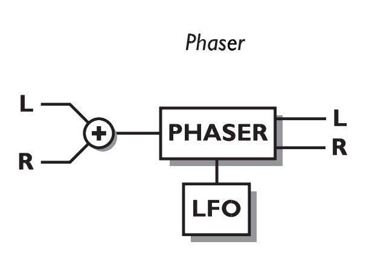

Speed Керує швидкістю Phaser.

`Tempo`  Параметр `Tempo` встановлює зв’язок із глобальним `Tempo`, наприклад, якщо встановити 1/4T, ви отримаєте quarter note triplets введеного натисканням `tempo`. 1/4 дорівнює BPM (tapped `Tempo`).

Якщо вибрати “Ignored”, поточний параметр використовуватиме `Preset` value і не залежатиме від Global `Tempo`.

Depth  Регулює Depth Phaser.

Order  Встановлює кількість фільтрів, що використовуються для створення Phaser.

Три варіанти — 4, 8 і 12 — звучать дуже по-різному. Спробуйте їх.

Feedback Level  Керує кількістю feedback у Phaser.

Зверніть увагу, що цей параметр може бути негативним, тобто feedback у reversed phase.

Instrument Mode  За допомогою mode parameter ви можете вибрати між guitar або bass range Phaser.

### Mix  Mix між direct sound і effect.

In Level  Керує вхідним рівнем блоку.

Керує вихідним рівнем блоку. `Mute mode`  Див.

`Mute mode` у вступі цього розділу.

Pan+Trem block  Panner по суті є зміною рівня в протилежних напрямках у left і right channels.

До цих рівнів під’єднано LFO, який піднімає й опускає їх.

Tremolo також є зміною рівня, керованою LFO, за винятком того, що зміна рівня в left і right channels однакова.

Отже, основна різниця між Panner і Tremolo полягає в тому, чи зміна рівня в left і right channels протилежна чи однакова.

Цей Panner має surround range, тобто він pan далі, ніж звичайне stereo image.

Tremolo має гнучкість, якої ви не побачите в жодному stomp box.

#### TREMOLO / PAN

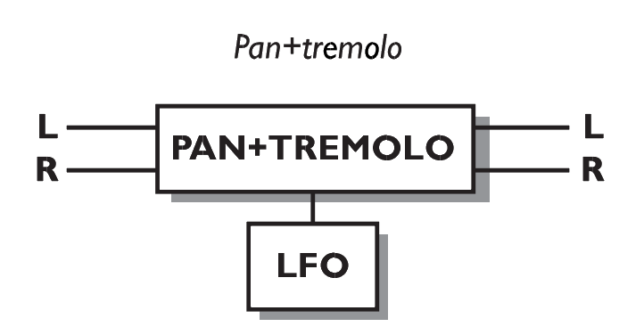

Tremolo Speed Керує тим, наскільки швидко Tremolo пульсує.

`Tempo`  Параметр `Tempo` встановлює зв’язок із глобальним `Tempo`, наприклад, якщо встановити 1/4T, ви отримаєте quarter note triplets введеного натисканням `tempo`. 1/4 дорівнює BPM (tapped `Tempo`).

Якщо вибрати “Ignored”, поточний параметр використовуватиме `Preset` value і не залежатиме від Global `Tempo`.

Depth  Встановлює інтенсивність Tremolo або те, наскільки глибоко він sweep.

Curve Встановлює curve LFO.

Виберіть між: Square, Sine або Triangle.

Найпоширеніша LFO curve в Tremolo — Triangle.

Спробуйте Square waveform з 100% Depth, щоб отримати “дірки” у звуці гітари (це називається Transforming).

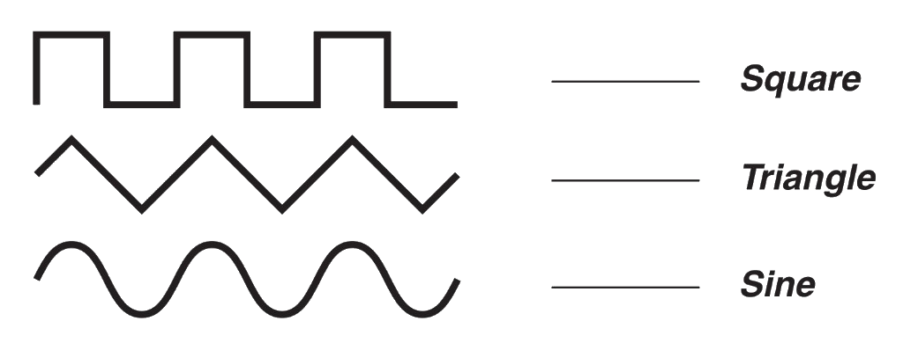

### Pulsewidth (only in Advanced)

Керує поділом верхньої та нижньої частини поточної waveform, наприклад, якщо Pulsewidth встановлено на 75%, верхня половина waveform буде увімкнена 75% часу.

### LFO Phase (only in Advanced)

Зміна LFO phase спричиняє невелику затримку в одній із початкових точок waveform.

Це означає, що left і right outputs починають поточну waveform у двох різних точках.

### Приклад:

Якщо LFO phase встановлено на 180º, left і right будуть точно протилежними.

### Mix  Mix між direct sound і effect.

In Level  Керує вхідним рівнем блоку.

Out Level  Керує вихідним рівнем блоку. `Mute mode`  Див.

`Mute mode` у вступі цього розділу.

Speed Керує швидкістю Panner.

Простий Panner завжди pan повністю left і right.

`Tempo`  Параметр `Tempo` встановлює зв’язок із глобальним `Tempo`, наприклад, якщо встановити 1/4T, ви отримаєте quarter note triplets введеного натисканням `tempo`. 1/4 дорівнює BPM (tapped `Tempo`).

Якщо вибрати “Ignored”, поточний параметр використовуватиме `Preset` value і не залежатиме від Global `Tempo`.

### Curve (only in Advanced)

Встановлює curve LFO.

Виберіть між: Square, Sine або Triangle.

Найпоширеніша curve в Panning — Sine.

### Pulsewidth (only in Surround Panner)

Керує поділом лівої та правої частини поточної waveform, тобто якщо Pulsewidth встановлено на 75%, left channel буде увімкнений 75% часу. (див. pulsewidth figure в Tremolo).

### LFO Phase (only in Surround Panner)

Зміна LFO phase спричиняє невелику затримку в одній із початкових точок waveform.

Це означає, що left і right outputs починають поточну waveform у двох різних точках.

### Приклад:

Якщо LFO phase встановлено на 180º, left і right будуть точно протилежними.

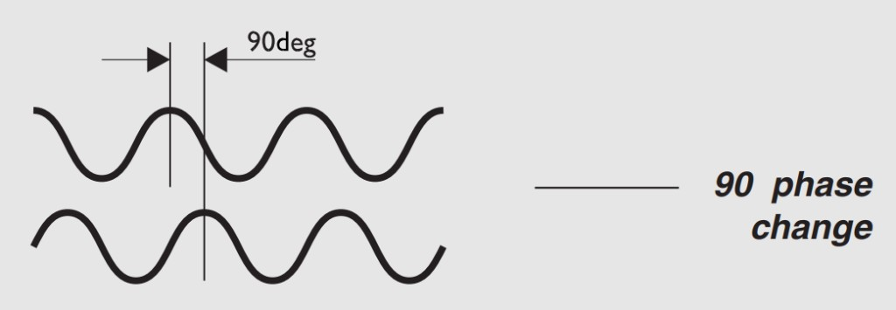

Pan Center За допомогою цього параметра ви можете перемістити center Panner.

90 phase change у поєднанні з широким Depth змушує Panner pan за межі звичайного stereo image.

### Width   (only in Surround Panner) Керує Width Panner.

Коли Width встановлено більше ніж 100%, Panner pan за межі звичайного stereo image. Спробуйте.

### Mix  Mix між direct sound і effect.

In Level  Керує вхідним рівнем блоку.

Out Level  Керує вихідним рівнем блоку. `Mute mode`  Див.

`Mute mode` у вступі цього розділу.

### Блок Pitch

У блоці `Pitch` є два базові типи `Pitch`: Fixed і Intelligent.

Різниця між ними полягає в тому, що Intelligent pitcher здатний залишатися в певній key і scale, тоді як Fixed `pitch` завжди додаватиме ту саму кількість `pitch` незалежно від вхідного сигналу.

Алгоритм Detune використовується для менших значень `pitch`, щоб створювати doubling sounds.

Оптимальне `pitch` detection досягається, якщо розмістити блок `Pitch` якомога ближче до Input section.

Дуже важливо бути точно налаштованим під час гри з Intelligent pitcher.

Для цього використовуйте `Tuner`.

#### INTELLIGENT PITCHER

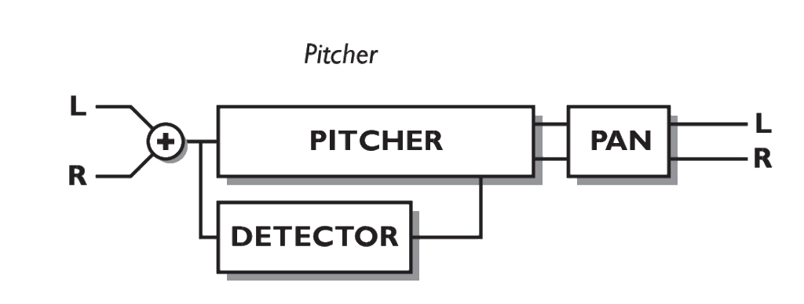

Key За допомогою цього параметра ви можете вказати G-Force, у якій key ви граєте.

Це дуже важлива інформація, оскільки voices intelligent pitcher генеруються на її основі.

Scale  Встановлює scale, яку використовує Intelligent Pitcher, тобто voices від G-Force будуть у межах цієї поточної scale.

Рекомендується, щоб ця scale збігалася зі scale, у якій ви граєте, інакше ви можете отримати дуже дивні voicings.

### Mode  Виберіть mode Intelligent Pitcher.

Stepped: Pitcher гратиме лише ноти в межах поточної scale і key незалежно від того, що ви граєте.

Smooth: Pitcher слідуватиме за вхідним сигналом.

Це означає, що ви можете bend тон, і Pitcher bend разом із вами.

Voice 1-2  Встановлює step у поточній scale і key, у якому ви хочете, щоб pitcher грав.

### Приклад:

Ви хочете, щоб G-Force грав третій step у C-Major.

Встановіть Key на C і Scale на Ionian Major.

Тепер встановіть Voice 1 на step 3.

Незалежно від того, що ви граєте в C-Major, G-Force тепер гратиме/transpose на два кроки вище по scale, тобто якщо ви зараз граєте C, G-Force гратиме E, який є третім step C-Major.

### Max. pitch — +/- one octave.

Detune Voice 1-2  Регулює detune двох Voices.

Під’єднавши LFO до цих параметрів, ви можете додати vibrato до `pitch` voices.

`Delay` 1-2  Встановлює `Delay` кожного з двох voices.

### Max. delay time на voice — 400 ms.

Pan Position 1-2  Керує panning кожного з двох `pitch` voices. Level 1-2  Встановлює рівень двох `pitch` voices.

### Mix  Mix між direct sound і effect.

In Level  Керує вхідним рівнем блоку.

Out Level  Керує вихідним рівнем блоку Intelligent Pitcher. `Mute mode`  Див.

`Mute mode` у вступі цього розділу.

Custom Scale  Custom scale дозволяє створити власну scale, вказавши кількість нот, root key і конкретні ноти, що входять до поточної scale.

Notes used  Використовуйте цей параметр, щоб вказати кількість нот у вашій Custom scale.

Custom scale має містити мінімум 4 і максимум 8 нот.

Tonic  Встановлює root key вашої Custom Scale. Note 2 -

8. Використовуйте ці параметри, щоб вказати ноти, які ви хочете у вашій Custom scale.
Ви можете вказати лише кількість нот, встановлену параметром “Notes Used”.

Custom scale має бути описана в межах однієї octave.

### Fixed 1 &

2. Voice `Pitch`  Voice 1-2  Встановлює кількість `pitch` на кожному з двох voices.
### Maximum pitch — +/- 12 semitones.

`Delay` 1-2  Встановлює `Delay` кожного з двох voices.

### Maximum delay time на voice — 400 ms.

Level 1-2  Встановлює рівень двох `pitch` voices.

Pan Position 1-2  Керує panning кожного з двох `pitch` voices.

Feedback 1-2  Встановлює кількість Feedback на двох voices.

Це може створити дійсно дивні effect, оскільки сигнал буде `pitch` знову і знову, тобто він підніматиметься/опускатиметься все більше протягом певного часу.

### Mix  Mix між direct sound і effect.

In Level  Керує вхідним рівнем блоку.

Out Level  Керує вихідним рівнем блоку `Pitch`. `Mute mode`  Див.

`Mute mode` у вступі цього розділу

2. Voice
2. Octave  Voice 1 & Voice
2. Встановлює кількість `pitch` на кожному з двох voices.
### Maximum pitch — +/- 24 semitones.

### Delay   - Voice1 & Voice

2. Встановлює `Delay` кожного з двох voices.
### Maximum delay time на voice — 400 ms.

Pan Position 1-2  Керує panning кожного з двох `pitch` voices.

Feedback 1-2  Встановлює кількість Feedback на двох voices.

Це може створити дійсно дивні effect, оскільки сигнал буде `pitch` знову і знову, тобто він підніматиметься/опускатиметься все більше протягом певного часу.

### Mix  Mix між direct sound і effect.

In Level  Керує вхідним рівнем блоку. Блок `Delay` має п’ять різних sub-algorithms: Stereo, Dual, Dual Two-tap, One-tap і Quad-tap.

Effect Spillover з одного `preset` в інший можна отримати, використовуючи той самий sub-algorithm і поєднання `Mute mode` = “`Fx In`” із `bypass` поточного блоку.

### Приклад:

Якщо ви хочете залишити `Delay` tail, що триватиме після зміни `preset`, переконайтеся, що в обох `preset` використовується той самий sub-algorithm.

Крім того, виберіть `Mute mode` “`Fx In`” і просто `bypass` блок `Delay` у другому `preset`.

Зміна параметрів, таких як Feedback або `Mix`, під час зміни `preset` може знищити `Delay`.

### Stereo Delay

#### STEREO DELAY

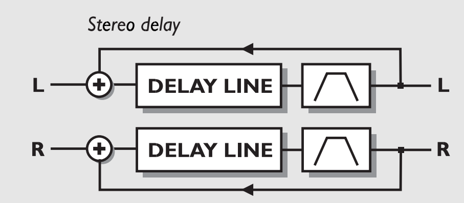

Time Встановлює `delay` time обох каналів Left і Right.

### Maximum delay time — 740 ms.

`Tempo`  Параметр `Tempo` встановлює зв’язок із глобальним `Tempo`, наприклад, якщо встановити 1/4T, ви отримаєте quarter note triplets введеного натисканням `tempo`. 1/4 дорівнює BPM (tapped `Tempo`).

Якщо вибрати “Ignored”, поточний параметр використовуватиме `Preset` value і не залежатиме від Global `Tempo`.

Feedback  Регулює Feedback обох каналів Left і Right.

Якщо параметр Feedback встановлено на 100%, G-Force зациклить `Delay` signal.

Під’єднайте Expression pedal і спробуйте `preset` 174 і 175 для початку.

Out Level  Керує вихідним рівнем блоку `Pitch`. `Mute mode`  Див.

`Mute mode` у вступі цього розділу  Detune  Voice 1-2  Встановлює кількість `pitch` на кожному з двох voices.

### Maximum pitch — +/- 50 cents.

`Delay` 1-2  Встановлює `Delay` кожного з двох voices.

### Maximum delay time на voice — 400 ms.

Pan Position 1-2  Керує panning кожного з двох detune voices.

Level 1-2  Встановлює рівень двох detune voices.

### Mix  Mix між direct sound і effect.

In Level  Керує вхідним рівнем блоку.

Out Level  Керує вихідним рівнем блоку `Pitch`. `Mute mode`  Див.

`Mute mode` у вступі цього розділу. Lowcut  Відсікає частоти нижче вибраної частоти.

Slope фільтра — 12dB/octave.

Highcut  Відсікає частоти вищі за вибрану частоту.

Якщо ви відчуваєте, що у сигналі забагато treble, усуньте це, зменшивши highcut filter.

Slope фільтра — 12dB/octave.

### Mix  Mix між direct sound і effect.

Під’єднайте цей параметр (`Mix`) до Envelope follower у Modifier Matrix, щоб створити dynamic `delay`.

In Level  Керує вхідним рівнем блоку.

Out Level  Керує вихідним рівнем блоку `Delay`. `Mute mode`  Див.

`Mute mode` у вступі цього розділу.

### Dual Delay

#### DUAL DELAY

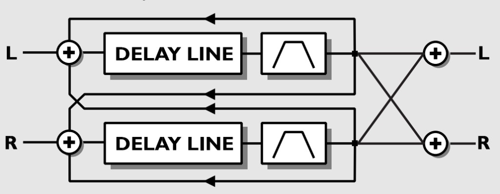

Time 1 Встановлює `delay` time першого `Delay` tap.

Maximum delay time — 740 ms.

Time 2 Встановлює `delay` time другого `Delay` tap.

Maximum delay time — 740 ms.

`Tempo` 1&2  Параметр `Tempo` встановлює зв’язок із глобальним `Tempo`, наприклад, якщо встановити 1/4T, ви отримаєте quarter note triplets введеного натисканням `tempo`. 1/4 дорівнює BPM (tapped `Tempo`).

Якщо вибрати “Ignored”, поточний параметр використовуватиме `Preset` value і не залежатиме від Global `Tempo`.

### Feedback 1 to 1/Feedback 2 to

2. Встановлює кількість feedback від `Delay` 1 до 1 і від `Delay` 2 до 2.
Сума чотирьох feedbacks обмежена 100%.

### Feedback 1 to 2/ Feedback 2 to 1.

Встановлює кількість cross feedback від `Delay` 1 до 2 і `Delay` 2 до 1.

Levels  Встановлює рівень кожної з двох `delay` lines.

Pan 1-2  Керує panning двох `Delay` taps.

Під’єднайте LFO до одного або обох цих параметрів, і ви отримаєте додатковий autopanner.

Lowcut 1-2  Відсікає частоти нижче вибраної частоти.

Slope фільтра — 12dB/octave.

Highcut 1-2  Відсікає частоти вищі за вибрану частоту.

Якщо ви відчуваєте, що у сигналі забагато treble, усуньте це, зменшивши highcut.

Slope фільтра — 12dB/octave.

### Mix  Mix між direct sound і effect.

In Level  Керує вхідним рівнем блоку.

Out Level  Керує вихідним рівнем блоку `Delay`. `Mute mode`  Див.

`Mute mode` у вступі цього розділу.

### Dual Two Tap Delay

#### DUAL TWO TAP DELAY

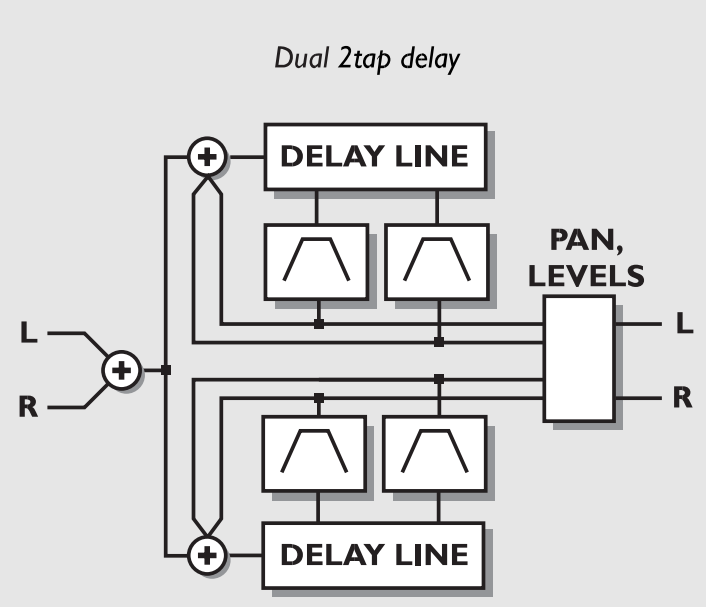

Dual Two Tap `Delay` здатний виконувати два `delay` taps на кожній з двох `delay` lines.

Дві `delay` lines мають власний Input level, що по суті означає, що вони працюють як два окремі `delay` processors.

`Delay` line 1&2  Time 1-2  Встановлює `delay` time двох taps на `Delay` line

1. Maximum `delay` time на tap — 1480 ms.
`Tempo`  Параметр `Tempo` встановлює зв’язок із глобальним `Tempo`, наприклад, якщо встановити 1/4T, ви отримаєте quarter note triplets введеного натисканням `tempo`. 1/4 дорівнює BPM (tapped `Tempo`).

Якщо вибрати “Ignored”, поточний параметр використовуватиме `Preset` value і не залежатиме від Global `Tempo`.

Feedback 1-2  Встановлює кількість feedback на Tap 1 і

2. ПРИМІТКА: Сума двох feedbacks обмежена 100%.
Levels 1-2  Встановлює рівень кожного з двох taps.

Pan 1-2  Керує panning двох `Delay` taps.

Lowcut 1-2  Відсікає частоти нижче вибраної частоти.

Slope фільтра — 12dB/octave.

Highcut 1-2  Відсікає частоти вищі за вибрану частоту.

Якщо ви відчуваєте, що у сигналі забагато treble, усуньте це, зменшивши highcut filter.

Slope фільтра — 12dB/octave.

Line Level 1-2  Регулює input level двох `Delay` lines.

Це дозволяє знизити рівень однієї з двох lines, не впливаючи на другу.

Line level — це процентне коригування algorithm In Level.

Ці рівні можна використовувати для створення spillover від slap back `Delay` у Line 1 до повільнішого lead `Delay` у Line

2. Підніміть рівень Line 1 і знизьте Level Line 2 у `Preset` 1 і навпаки у `preset`
2. `Delay` тепер продовжуватимуть звучати під час зміни `preset`.
### Mix  Mix між direct sound і effect.

In Level  Керує вхідним рівнем блоку.

Out Level  Керує вихідним рівнем блоку `Delay`. `Mute mode`  Див.

`Mute mode` у вступі цього розділу. One Tap `Delay`  Time  Встановлює `delay` time.

### Maximum delay time — 1480 ms.

`Tempo`  Параметр `Tempo` встановлює зв’язок із глобальним `Tempo`, наприклад, якщо встановити 1/4T, ви отримаєте quarter note triplets введеного натисканням `tempo`. 1/4 дорівнює BPM (tapped `Tempo`).

Якщо вибрати “Ignored”, поточний параметр використовуватиме `Preset` value і не залежатиме від Global `Tempo`.

Feedback  Регулює кількість Feedback.

### Pan position  Керує panning Delay.

Lowcut  Відсікає частоти нижче вибраної.

Slope фільтра — 12dB/octave.

Highcut  Відсікає частоти вищі за вибрану частоту.

Якщо ви відчуваєте, що у сигналі забагато treble, усуньте це, зменшивши highcut filter.

Slope фільтра — 12dB/octave.

### Mix  Mix між direct sound і effect.

In Level  Керує вхідним рівнем блоку.

Out Level  Керує вихідним рівнем блоку `Delay`  `Mute mode`  Див.

`Mute mode` у вступі цього розділу.

### Quad Tap Delay

#### QUAD TAP DELAY

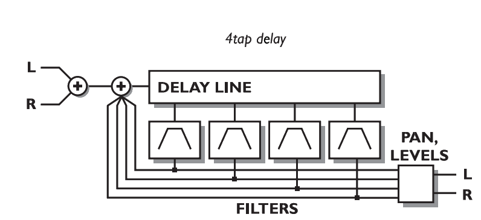

Tap 1-4  Встановлює `delay` time чотирьох taps.

Maximum delay time на tap — 1480 ms.

`Tempo` 1-4  Параметр `Tempo` встановлює зв’язок із глобальним `Tempo`, наприклад, якщо встановити 1/4T, ви отримаєте quarter note triplets введеного натисканням `tempo`. 1/4 дорівнює BPM (tapped `Tempo`).

Якщо вибрати “Ignored”, поточний параметр використовуватиме `Preset` value і не залежатиме від Global `Tempo`.

Feedback 1-4  Регулює кількість Feedback від кожного з чотирьох taps.

### ПРИМІТКА:

Сума чотирьох feedbacks обмежена 100%.

Levels 1-4  Встановлює рівень кожного з чотирьох taps.

Pan position 1-4  Керує panning чотирьох `Delay` taps.

Lowcut 1-4  Відсікає частоти нижче вибраної.

Slope фільтра — 12dB/octave.

Highcut 1-4  Відсікає частоти вищі за вибрану частоту.

Якщо ви відчуваєте, що у сигналі забагато treble, усуньте це, зменшивши highcut filter.

Slope фільтра — 12dB/octave.

### Mix  Mix між direct sound і effect.

In Level  Керує вхідним рівнем блоку.

Out Level  Керує вихідним рівнем блоку `Delay`  `Mute mode`  Див.

`Mute mode` у вступі цього розділу.

### Блок Drive

### Блок Drive  Drive — це post distortion.

Його можна використовувати для effect, наприклад, для overdriving `Delay`, Flanger або Phaser тощо, або просто щоб трохи підсилити загальний звук.

`Drive`  Параметр `Drive` імітує In-gain distortion device.

Додатковий In-gain автоматично компенсується на Output level, щоб уникнути internal clipping.

Brightness  Brightness використовується для зменшення кількості high frequency content у distorted signal.

Brightness `control` є flat, коли встановлено на 100%.

Body  Body використовується для зменшення кількості low frequency content у distorted signal.

При сильному distortion `Drive` підкреслює багато low frequencies, що може бути дещо дратівливим.

Ці проблеми можна зменшити параметром Body.

Кілька preamps і pedals на ринку поєднують lowcut filter зі своїм In-gain, щоб компенсувати саме цю проблему.

Smasher  Smasher використовується для зміни характеру distortion, підкреслюючи even order harmonics.

Встановлення цього параметра на високе значення “розіб’є” ваш сигнал.

Спробуйте поекспериментувати з характером вашого distortion.

## Utility, Tempo та Tuner

Outdrive імітує той вид distortion, який ви отримали б від output stage amplifier.

### Mix  Mix між direct sound і effect.

In Level  Керує вхідним рівнем блоку.

Out Level  Керує вихідним рівнем блоку `Drive`.

Під’єднайте цей параметр до Envelope follower у Modifier Matrix, щоб усунути noise від `Drive`. `Mute mode`  Див.

`Mute mode` у вступі цього розділу.

### Блок Chorus/Flanger

Блок `Chorus` базується на спадщині TC 2290 Dynamic `Delay` і 1210 `Chorus`/Flanger.

`Chorus`/Flanger по суті є коротким `delay`, який модуляється LFO.

Різниця між `Chorus` і Flanging — це Feedback Flanger.

Саме цей параметр дає вам той класичний mid-range tone.

Модуляція короткого `delay` створює дуже невеликі варіації `pitch`; ці зміни `pitch`, змішані з direct sound, дають звук `Chorus`, тоді як лише modulated signal дасть `Pitch` modulator, також відомий як Vibrato.

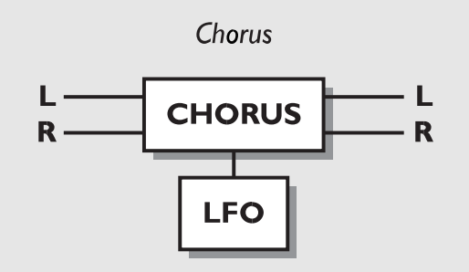

#### CHORUS/FLANGER

Classic `Chorus` використовує зв’язок між Speed і Depth, який називається Golden Ratio. G-Force успадкував цю функцію від TC 2290.

Speed  Швидкість `Chorus`, також відома як Rate.

`Tempo`  Параметр `Tempo` встановлює зв’язок із глобальним `Tempo`, наприклад, якщо встановити 1/4T, ви отримаєте quarter note triplets введеного натисканням `tempo`. 1/4 дорівнює BPM (tapped `Tempo`).

Якщо вибрати “Ignored”, поточний параметр використовуватиме `Preset` value і не залежатиме від Global `Tempo`.

Depth  Регулює depth `Chorus`, також відомий як Intensity.

### Mix  Mix між direct sound і effect.

In Level  Керує вхідним рівнем блоку. `Mute mode`  Див.

`Mute mode` у вступі цього розділу.

Створіть Vibrato, встановивши `Mix` на 100%, Depth на 5-10% і Speed на 1-2 Hz. right outputs починають поточну waveform у двох різних точках.

### Приклад:

Якщо LFO phase встановлено на 180º, left і right будуть точно протилежними.

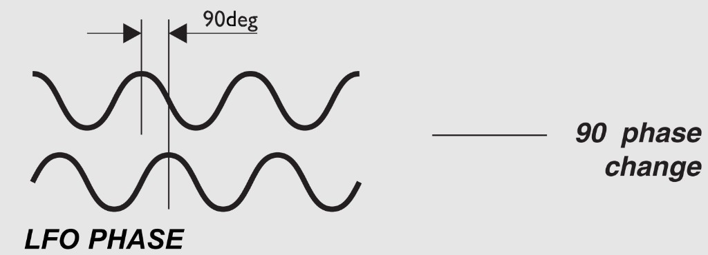

#### LFO PHASE

Mix між direct sound і effect.

Inlevel  Керує вхідним рівнем блоку. `Mute mode`  Див.

`Mute mode` у вступі цього розділу.

Flanger Classic  Classic Flanger використовує зв’язок між Speed і Depth, який називається Golden Ratio. G-Force успадкував це від TC 2290.

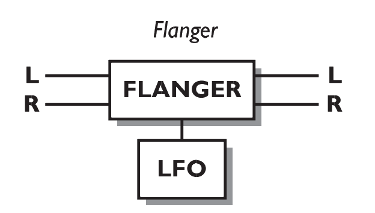

#### FLANGER CLASSIC

Speed  Швидкість Flanger, також відома як Rate.

`Tempo`  Параметр `Tempo` встановлює зв’язок із глобальним `Tempo`, наприклад, якщо встановити 1/4T, ви отримаєте quarter note triplets введеного натисканням `tempo`. 1/4 дорівнює BPM (tapped `Tempo`).

Якщо вибрати “Ignored”, поточний параметр використовуватиме `Preset` value і не залежатиме від Global `Tempo`.  90 phase change  Advanced `Chorus` додає кілька додаткових параметрів, таких як LFO Phase і Curve.

Speed  Швидкість `Chorus`, також відома як Rate.

`Tempo`  Параметр `Tempo` встановлює зв’язок із глобальним `Tempo`, наприклад, якщо встановити 1/4T, ви отримаєте quarter note triplets введеного натисканням `tempo`. 1/4 дорівнює BPM (tapped `Tempo`).

Якщо вибрати “Ignored”, поточний параметр використовуватиме `Preset` value і не залежатиме від Global `Tempo`.

Depth  Регулює depth `Chorus`, також відомий як Intensity.

`Delay`  Як описано раніше, `Chorus`/Flanger по суті є `Delay`, який модуляється LFO.

Цей параметр дозволяє змінити довжину цього `Delay`.

Типовий `Chorus` використовує `delay` приблизно 10 ms, тоді як Flanger — близько 5 ms.

Golden Ratio  Встановлює Golden Ratio між Speed і Depth On/Off.

Якщо ви хочете створити wild `Chorus` sounds, можливо, варто вимкнути Golden Ratio.

Phase Reversed  Інвертує phase right channel, але лише на effect signal.

Ця функція робить stereo image значно ширшим.  LFO Curve  Встановлює curve LFO.

Виберіть між: Sine або Triangle.

Найпоширеніша waveform в `Chorus` — Sine. (див. curve figures в Tremolo)  LFO Phase  Зміна LFO phase спричиняє невелику затримку в одній із Depth  Регулює depth Flanger, також відомий як Intensity.

Feedback  Керує кількістю feedback у Flanger.

Зверніть увагу, що цей параметр може бути негативним, тобто feedback у reversed phase.

### Mix  Mix між direct sound і effect.

In Level  Керує вхідним рівнем блоку. `Mute mode`  Див.

`Mute mode` у вступі цього розділу.

Advanced Flanger  Advanced Flanger додає кілька додаткових можливостей, таких як Cross Feedback, LFO phase і Curve.

Speed  Швидкість Flanger, також відома як Rate.

`Tempo`  Параметр `Tempo` встановлює зв’язок із глобальним `Tempo`, наприклад, якщо встановити 1/4T, ви отримаєте quarter note triplets введеного натисканням `tempo`. 1/4 дорівнює BPM (tapped `Tempo`).

Якщо вибрати “Ignored”, поточний параметр використовуватиме `Preset` value і не залежатиме від Global `Tempo`.

Depth  Регулює depth Flanger, також відомий як Intensity.

`Delay`  Як описано раніше, `Chorus`/Flanger по суті є `Delay`, який модуляється LFO.

Цей параметр дозволяє змінити довжину цього `Delay`.

Типовий `Chorus` використовує `delay` приблизно 10 ms, тоді як Flanger використовує `delay` близько 5 ms.

Feedback  Керує кількістю feedback у Flanger.

Зверніть увагу, що цей параметр може бути негативним, тобто feedback у reversed phase.

Golden Ratio  Встановлює Golden Ratio між Speed і Depth On/Off.

Якщо ви хочете створити wild Flanger sounds, можливо, варто вимкнути Golden Ratio.

Phase Reversed  Інвертує phase right channel, але лише на effect signal.

Ця функція робить stereo image значно ширшим.

Cross Feedback  Керує кількістю feedback між двома channels.

Зверніть увагу, що Crossfeed може бути негативним, тобто Crossfeed у reversed phase.  LFO Curve  Встановлює curve LFO.

Виберіть між: Sine або Triangle.

Найпоширеніша waveform в Flanging — Sine. (див. curve figures в Tremolo)  LFO Phase  Зміна LFO phase спричиняє невелику затримку в одній із початкових точок waveform.

Це означає, що left і right outputs починають поточну waveform у двох різних точках.

### Приклад:

Якщо LFO встановлено на 180º, left і right будуть точно протилежними. (Див. LFO phase figure в розділі `Chorus`).

### Mix  Mix між direct sound і effect.

In Level  Керує вхідним рівнем блоку. `Mute mode`  Див.

`Mute mode` у вступі цього розділу.

### Блок Reverb

`Reverb` у G-Force базується на спадщині M5000 і M2000 і налаштований для використання з гітарою.

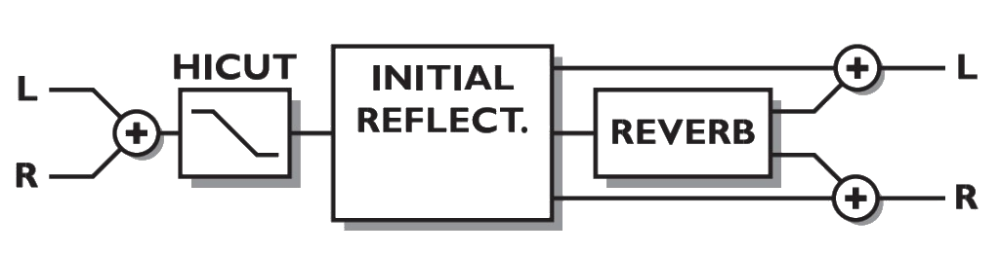

#### REVERB

Секція `Reverb` G-Force може створювати різноманітні `Reverb` `effects`, включно з емуляцією initial reflections кімнати, що створює вражаючі просторові effect, досі доступні лише в TC M5000.

Використовуючи `reverb` G-Force, варто бачити `reverb` як дві частини:

1. Initial room reflections
2. The Decay Initial room reflections, залежно від розміру кімнати, — це перші 50-200ms `Reverb`, і саме ці відбиття містять інформацію про розмір і форму кімнати та створюють ширину й більшу частину глибини, яку ви відчуваєте в реальній залі або кімнаті.
The Decay — це пізніша частина natural `reverb`, яку сприймають як продовження звуку та створення певної глибини позаду джерела або direct signal, інтегруючи його в просторові характеристики зали або кімнати, як ви відчуваєте в natural ambience або `reverb`.

Емулюючи initial room reflections, G-Force може створювати дуже глибокі й широкі stereo images, розміщуючи джерело або direct signal у залі/кімнаті без використання довгих decay times, які часто роблять звуковий образ дуже “crowded” і заважають вашій грі.

Щоб перевірити, що можуть дати initial reflections, зменшіть або опустіть Decay level у секції Decay parameters і підніміть Room level у секції Room parameters.

Потім спробуйте змінити Room size і Room shape у Master section і виберіть поєднання, яке вам подобається.

Потім спробуйте змінити Color у Room parameters.

Ви почуєте короткий spatial `reverb`, який звучить трохи як “gated” `reverb`.

Нарешті додайте decay, піднявши Decay level у секції Decay parameters, і виберіть decay time, який вам подобається.

Ви також почуєте, що можете створити дуже просторово широкий і глибокий stereo `reverb` із відносно коротким і низьким рівнем decay.

Коли ви слухаєте лише initial reflections `Reverb` на високому рівні й вибираєте Room size XL, Grand або Huge, може виникнути “slapback” effect, але додавши правильну довжину й кількість decay і збалансувавши Room level, ви побачите, що це перетвориться на width і depth.

Square   Типова квадратна кімната з чітко визначеними reflection patterns.

Round   Diffuse кімната з живими reflections.

Curved   М’який, але все ще визначений набір reflections.

Room size  Встановлює розмір кімнати, яку емулюють initial room reflections.

Автоматично змінює довжину Predelay (час до появи першого reflection) і Decay start (час, коли починається Decay tail `Reverb`).

Predelay і Decay start можна окремо налаштувати на іншу довжину в секціях Room і Decay алгоритму.

Box - Tiny - Small - Medium - Large - XL - Grand - Huge Розміри: Box, Tiny, Grand & Huge — це patterns, що емулюють екстремальні room sizes.

`Reverb` level  Регулює сумарний Room level і Decay level і має розглядатися як master level.

Room level і Decay можна окремо налаштувати на інше співвідношення в секціях Room і Decay алгоритму.

### Range +/-50.

High color  Встановлює treble color decay.

Коли Color у секції Room алгоритму встановлено на Auto, він також керує treble factor initial room reflections.

Wool - Warm - Real - Clear - Bright - Crisp - Glass  High factor  Підкреслює або зменшує характер, заданий High color.

### Range +/-25.

Low color  Встановлює Bass color Decay.

Thick - Fat - Round - Natural - Light - Tight - Thin - No bass.

Low factor  Підкреслює або зменшує характер, заданий Low color.

### Range +/-25.

Room parameters  Регулює рівень initial room reflections, який master controlled параметром `Reverb` level.

За допомогою цього `control` ви можете підкреслити або зменшити вплив initial room reflection на звук `Reverb`.

### Range +/-50.

### Color  Встановлює tonal color initial reflections.

Коли встановлено Auto, він пов’язаний із High color Auto - Wool - Warm - Real - Clear - Bright - Crisp - Glass.

Color factor  Підкреслює або зменшує характер, заданий Color.

### Range +/-50.

Predelay  Дозволяє налаштувати predelay (час до появи першого reflection), який автоматично встановлюється під час вибору Room size.

### Range +/-50.

Decay level  Регулює рівень decay, який master controlled параметром `reverb` level.

За допомогою цього `control` ви можете підкреслити або зменшити вплив decay tail на звук `Reverb`.

### Range +/-50.

Diffuse  Дозволяє точно налаштувати density decay tails.

Автоматично встановлюється під час вибору потрібного Decay time.

Дає змогу зменшити flutter у decay до абсолютного мінімуму.

### Range +/-25.

Decay start  Дозволяє налаштувати decay start (час, коли починається Decay tail `Reverb`), який автоматично встановлюється під час вибору Room size.

### Range +/-50.

`Mix`  Цей параметр встановлює `mix` relation між dry (direct) і wet signal.

Якщо ви використовуєте G-Force як insert effect, це означає, що ваш direct signal проходить через G-Force.

In Level  Керує вхідним рівнем блоку.

Out Level  Керує вихідним рівнем блоку `Reverb`. `Mute mode`  Див.

`Mute mode` у вступі цього розділу.

### Simple Reverb

Simple `Reverb` базується на тому самому алгоритмі, що й Advanced, але число параметрів зменшено до 5.

Це дає змогу легко і швидко налаштувати `Reverb`.

Type  Задає тип `Reverb`, тобто автоматично визначає розмір і співвідношення між Predelay, Early reflections і Decay. (Див.

Advanced `Reverb` для додаткового пояснення).

Types: Room, Club, Hall, Church, Cathedral, Grand Hall, Fast Decay, Slow Decay, Plate, Spring.

Decay time  Задає тривалість затухання `reverb` від 0.01 - 20.0 seconds.

Predelay  Дозволяє регулювати predelay (час до появлення першого відбиття), який автоматично задається при виборі Type.

### Range +/-50.

`Reverb` level  Регулює сумарний Room level і Decay level; його можна розглядати як master level.

Room level і Decay можна індивідуально налаштувати на інше співвідношення у розділі Room and Decay алгоритму.

### Range +/-50.

Color  Задає тональний Color початкових відбиттів.

При значенні Auto він пов'язаний із High color.

Wool - Warm - Real - Clear - Bright - Crisp - Glass - Extreme.

`Mix`  Цей параметр задає співвідношення між dry (прямим) і wet сигналом.

Якщо ви використовуєте G-Force як insert effect, це означає, що ваш прямий сигнал проходить через G-Force.

In Level  Регулює In Level блоку.

Out Level  Регулює Out Level блоку `Reverb`. `Mute mode`  Див.

`Mute mode` у вступі до цього розділу.

Output  Розділ Output містить master output level і набір Speaker Filters.

Усі параметри Out Section є лише глобальними, тобто не включаються під час збереження `preset`.

Level  У блокі Output, окрім потенціометра на передній панелі, є overall Outlevel.

Цей Outlevel можна контролювати через `MIDI` або педаль, налаштовуючи його в `I/O Setup`, `Control` display через параметр Main Volume.

Outlevel не включається в `preset`.

Speaker Filters  Speaker Filters призначені для зрізу частини високих і низьких частот, як це робить кабінет гітарного усилювача.

Це дає змогу репетирувати з G-Force на домашній стереосистемі з preamp або педаллю та навушниками.

Filters  Вмикає/вимикає Speaker Filter On/Off.

Locut  Частота зрізу Locut filter може бути 40 або 80Hz.

Hicut  Частота зрізу Hicut може бути 2,5kHz, 3kHz, 3,5kHz, 4kHz, 4,5kHz або 5kHz.

## Сторінка Reset

### Як відкрити Reset page

Утримуйте `Overall Bypass` key під час включення.

Переміщуйте маркер `Parameter wheel` і натисніть `Enter`, щоб вибрати потрібний тип RESET.

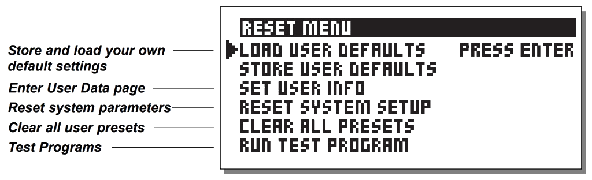

Load `User` Defaults  Це скидає всі системні параметри до default setup, створеного вами (Див.

### Store User Def).

Це скидання НЕ видаляє `User` presets G-Force.

`Store` `User` Defaults  Коли у вас ідеальне налаштування G-Force, ви можете зберегти його як свій default setup.

Ця функція, наприклад, дуже зручна, коли ви завершили спеціальне продюсування і хочете повернутися до нормального режиму.

Коли у вас ідеальне налаштування G-Force, просто виберіть цей параметр і натисніть `Enter`, щоб зберегти ваші default settings.

Set `User` Info  Ця функція дозволяє зберегти ваше ім'я та номер телефону в G-Force.

Натисніть `Enter`, щоб відкрити `User` data menu.

Використовуйте `Value wheel` і `Parameter wheel`, щоб ввести ім'я та номер телефону в G-Force.

Натисніть `Enter`, щоб підтвердити.

Ваше ім'я та номер телефону відображатимуться під час включення.

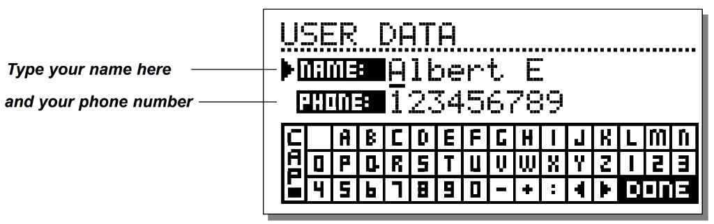

Reset System Setup  Це скидає всі системні параметри до factory default.

Це скидання НЕ видаляє `User` presets G-Force.

Clear all Presets  Це видаляє всі `User` presets.

Run Test Program  Див. опис на сторінці 53.

### Test Programs

## Технічні характеристики

**Analog Inputs**

| Параметр | Значення |
| :--- | :--- |
| Connectors | 1/4" phone jack, unbalanced (Ring: grounded) |
| Impedance | 1 MOhm |
| Max. Input Level | +21 dBu |
| Sensitivity | @ 15 dB headroom: -26 dBu to +6 dBu |
| A to D Conversion | 24 bit (1 bit, 128 times oversampling) |
| A to D Delay | 0,9 ms @ 44.1 kHz |
| Dynamic Range | >105 dB |
| THD | 0.003% @ 1 kHz, 6 dB below full scale |
| Frequency Response | +0/-0.5 dB (20 Hz - 20 kHz) |
| Crosstalk | <-60 dB (20 Hz - 20 kHz) |

**Analog Outputs**

| Параметр | Значення |
| :--- | :--- |
| Connectors | 1/4" phone jack, balanced |
| Impedance | 100 Ohm (active transformer) |
| Max. Output Level | +22 dBu |
| Full Scale Output Range | -10 dBu to +22 dBu |
| D to A Conversion | 24 bit (1 bit, 128 times oversampling) |
| D to A Delay | 0.6 ms @ 44.1 kHz |
| Dynamic Range | >100 dB |
| THD | 0.005% @ 1 kHz, 6 dB below full scale |
| Frequency Response | +0/-0.5 dB (20 Hz - 20 kHz) |
| Crosstalk | <-60 dB (20 Hz - 20 kHz) |

**Digital Inputs and Outputs**

| Параметр | Значення |
| :--- | :--- |
| S/PDIF In/Out | Coaxial, RCA Type |
| Formats | EIAJ CP-340, IEC 958, S/PDIF (24 bit) |
| Sample Rate | 44.1 kHz |

**PCMCIA Interface**

| Параметр | Значення |
| :--- | :--- |
| Connector | PCMCIA Type 1 cards |
| Standards | PCMCIA 2.0, JEIDA 4.0 |
| Card Format | Supports up to 2 MB SRAM |

**Control Interface**

| Параметр | Значення |
| :--- | :--- |
| MIDI | In/Out/Thru: 5 Pin DIN |
| External control | 1/4" phone jack |

**General**

| Параметр | Значення |
| :--- | :--- |
| Finish | Лицьова панель із анодованого алюмінію. Шасі з покритої сталі. |
| LED | 3 LED meters, 5 x 14 dot LED-matrix |
| LCD | 56 x 128 dot graphic LCD-display |
| Dimensions | 19" x 1.75" x 8.2" (483 x 44 x 208 mm) |
| Weight | 5.0 lb. (2.25 kg) |
| Mains Voltage | 100 to 240 VAC, 50 to 60 Hz (auto-select) |
| Power Consumption | <20 W |
| Backup Battery Life | >10 years |

**EMC**

| Параметр | Значення |
| :--- | :--- |
| Complies with | EN 55103-1, EN 55103-2 and Class B limits of FCC rules, part 15 |

**Safety**

| Параметр | Значення |
| :--- | :--- |
| Certified to | EN 60065, UL 1419 |

**Environment**

| Параметр | Значення |
| :--- | :--- |
| Operating Temperature | 32 °F to 122 °F (0 °C to 50 °C) |
| Storage Temperature | -22 °F to 167 °F (-30 °C to 70 °C) |
| Humidity | Max. 90% non-condensing |

> **NOTE:** У зв'язку з постійним розвитком і стандартизацією всі специфікації можуть змінюватися без повідомлення.

## Усунення несправностей та MIDI

- Ви вибрали `Killdry` ON у `I/O Setup`, `Audio` menu.

Ви натискаєте `Power switch`, але нічого не відбувається.

- Вимикач на задній панелі вимкнено.

Ви не можете вимкнути пристрій.

- Натисніть і утримуйте `Power switch` 3 seconds, потім відпустіть, щоб вимкнути.

Немає звуку через G-Force.

- Ви використовуєте Analog input, але input selector у `I/O Setup`, `Audio` menu встановлено на Digital.

Звук фазується з вашим прямим сигналом.

- Ви використовуєте G-Force у parallel setup, але `killdry` function у `I/O Setup`, `Audio` menu встановлено на Off.

Правий input meter не показує сигнал.

- Ви вибрали L-Only у `I/O Setup`, `Audio` menu.

Ефекти лише в Left Output

- Ви використовуєте лише Left input, але Input selector у `I/O Setup` встановлено на Stereo.

Ваша Expression pedal не працює належним чином

- Переконайтеся, що G-Force налаштовано на правильний pedal type і педаль коректно калібрована в `Utility` menu.

## MIDI Implementation Chart

<table class="midi-chart-table">
<thead>
<tr>
<th>Function</th>
<th>Transmitted</th>
<th>Recognized</th>
<th>Remarks</th>
</tr>
</thead>
<tbody>
<tr>
<td class="midi-fn midi-fn-main">Basic Channel</td>
<td class="midi-tx"></td>
<td class="midi-rx"></td>
<td class="midi-remarks"></td>
</tr>
<tr>
<td class="midi-fn midi-fn-sub">Default</td>
<td class="midi-tx">1</td>
<td class="midi-rx">1</td>
<td class="midi-remarks"></td>
</tr>
<tr>
<td class="midi-fn midi-fn-sub">Changed</td>
<td class="midi-tx">1-16</td>
<td class="midi-rx">1-16</td>
<td class="midi-remarks"></td>
</tr>
<tr>
<td class="midi-fn midi-fn-main">Mode</td>
<td class="midi-tx"></td>
<td class="midi-rx"></td>
<td class="midi-remarks"></td>
</tr>
<tr>
<td class="midi-fn midi-fn-sub">Default</td>
<td class="midi-tx"></td>
<td class="midi-rx"></td>
<td class="midi-remarks"></td>
</tr>
<tr>
<td class="midi-fn midi-fn-sub">Messages</td>
<td class="midi-tx">X</td>
<td class="midi-rx">X</td>
<td class="midi-remarks"></td>
</tr>
<tr>
<td class="midi-fn midi-fn-sub">Altered</td>
<td class="midi-tx"></td>
<td class="midi-rx"></td>
<td class="midi-remarks"></td>
</tr>
<tr>
<td class="midi-fn midi-fn-main">Note Number</td>
<td class="midi-tx">X</td>
<td class="midi-rx">O</td>
<td class="midi-remarks"></td>
</tr>
<tr>
<td class="midi-fn midi-fn-sub">True Voice</td>
<td class="midi-tx">X</td>
<td class="midi-rx">X</td>
<td class="midi-remarks"></td>
</tr>
<tr>
<td class="midi-fn midi-fn-main">Velocity</td>
<td class="midi-tx"></td>
<td class="midi-rx"></td>
<td class="midi-remarks"></td>
</tr>
<tr>
<td class="midi-fn midi-fn-sub">Note ON</td>
<td class="midi-tx">X</td>
<td class="midi-rx">X</td>
<td class="midi-remarks"></td>
</tr>
<tr>
<td class="midi-fn midi-fn-sub">Note OFF</td>
<td class="midi-tx">X</td>
<td class="midi-rx">X</td>
<td class="midi-remarks"></td>
</tr>
<tr>
<td class="midi-fn midi-fn-main">After Touch</td>
<td class="midi-tx"></td>
<td class="midi-rx"></td>
<td class="midi-remarks"></td>
</tr>
<tr>
<td class="midi-fn midi-fn-sub">Key's</td>
<td class="midi-tx">X</td>
<td class="midi-rx">O</td>
<td class="midi-remarks"></td>
</tr>
<tr>
<td class="midi-fn midi-fn-sub">Ch's</td>
<td class="midi-tx">X</td>
<td class="midi-rx">X</td>
<td class="midi-remarks"></td>
</tr>
<tr>
<td class="midi-fn midi-fn-main">Pitch Bend</td>
<td class="midi-tx">X</td>
<td class="midi-rx">O</td>
<td class="midi-remarks"></td>
</tr>
<tr>
<td class="midi-fn midi-fn-main">Control Change</td>
<td class="midi-tx">0-127</td>
<td class="midi-rx">0-127</td>
<td class="midi-remarks"></td>
</tr>
<tr class="midi-section-divider"><td colspan="4"></td></tr>
<tr>
<td class="midi-fn midi-fn-main">Prog Change</td>
<td class="midi-tx">O</td>
<td class="midi-rx">O</td>
<td class="midi-remarks"></td>
</tr>
<tr>
<td class="midi-fn midi-fn-sub">True #</td>
<td class="midi-tx">0-127</td>
<td class="midi-rx">0-127</td>
<td class="midi-remarks"></td>
</tr>
<tr>
<td class="midi-fn midi-fn-main">System Exclusive</td>
<td class="midi-tx">O Bulkdump</td>
<td class="midi-rx">O Bulkdump</td>
<td class="midi-remarks"></td>
</tr>
<tr>
<td class="midi-fn midi-fn-main">Common</td>
<td class="midi-tx"></td>
<td class="midi-rx"></td>
<td class="midi-remarks"></td>
</tr>
<tr>
<td class="midi-fn midi-fn-sub">:Song Pos</td>
<td class="midi-tx">X</td>
<td class="midi-rx">X</td>
<td class="midi-remarks"></td>
</tr>
<tr>
<td class="midi-fn midi-fn-sub">:Song Sel</td>
<td class="midi-tx">X</td>
<td class="midi-rx">X</td>
<td class="midi-remarks"></td>
</tr>
<tr>
<td class="midi-fn midi-fn-sub">:Tune</td>
<td class="midi-tx">X</td>
<td class="midi-rx">X</td>
<td class="midi-remarks"></td>
</tr>
<tr>
<td class="midi-fn midi-fn-main">System real time</td>
<td class="midi-tx"></td>
<td class="midi-rx"></td>
<td class="midi-remarks"></td>
</tr>
<tr>
<td class="midi-fn midi-fn-sub">:Clock</td>
<td class="midi-tx">X</td>
<td class="midi-rx">X</td>
<td class="midi-remarks"></td>
</tr>
<tr>
<td class="midi-fn midi-fn-sub">:Commands</td>
<td class="midi-tx">X</td>
<td class="midi-rx">X</td>
<td class="midi-remarks"></td>
</tr>
<tr>
<td class="midi-fn midi-fn-main">Aux Messages</td>
<td class="midi-tx"></td>
<td class="midi-rx"></td>
<td class="midi-remarks"></td>
</tr>
<tr>
<td class="midi-fn midi-fn-sub">:Local ON/OFF</td>
<td class="midi-tx">X</td>
<td class="midi-rx">X</td>
<td class="midi-remarks"></td>
</tr>
<tr>
<td class="midi-fn midi-fn-sub">:All Notes OFF</td>
<td class="midi-tx">X</td>
<td class="midi-rx">X</td>
<td class="midi-remarks"></td>
</tr>
<tr>
<td class="midi-fn midi-fn-sub">:Active Sense</td>
<td class="midi-tx">X</td>
<td class="midi-rx">X</td>
<td class="midi-remarks"></td>
</tr>
<tr>
<td class="midi-fn midi-fn-sub">:Reset</td>
<td class="midi-tx">X</td>
<td class="midi-rx">X</td>
<td class="midi-remarks"></td>
</tr>
<tr>
<td class="midi-fn midi-fn-main">Notes</td>
<td class="midi-tx"></td>
<td class="midi-rx"></td>
<td class="midi-remarks"></td>
</tr>
<tr class="midi-section-divider"><td colspan="4"></td></tr>
</tbody>
</table>

<strong>O</strong>:YES &nbsp;&nbsp; <strong>X</strong>:NO

## Self Test

<strong>НАТИСНІТЬ <code>OVERALL BYPASS</code> KEY ПІД ЧАС УВІМКНЕННЯ, ЩОБ ДОСТУПИТИСЯ SELF-TEST І ВИБРАТИ »RUN TEST PROGRAM«</strong>

<em>Обертайте <code>Value Wheel</code> для переміщення між Self tests.</em>

<h4>Key test</h4>
Виберіть Key test, натиснувши <code>Enter</code>.

Ключі мають бути натиснуті у порядку, який запитує G-Force, щоб пройти тест.

Натисніть <code>Exit</code>, щоб вийти з Key test.

<h4>In/Out knobs test</h4>
Виберіть In/Out knobs test, натиснувши <code>Enter</code>.

Обертайте <code>In/Out knobs</code> до 30 і назад до 0, щоб пройти тест.

Натисніть <code>Exit</code>, щоб вийти з In/Out test.

<h4>Parameter + Value Wheel test</h4>
Виберіть тест, натиснувши <code>Enter</code>.

Обертайте <code>Value</code> і <code>Parameter wheel</code> до 30 і назад до 0, щоб пройти тест.

Натисніть <code>Exit</code>, щоб вийти з Adjust Wheel test.

<h4>LED test</h4>
Виберіть LEDs test, натиснувши <code>Enter</code>.

Обертайте Adjust Wheel, щоб перевірити LEDs.

Тест «ok», коли не горить жоден LED.

Натисніть <code>Exit</code>, щоб вийти з Led test.

<h4>Display test</h4>
Виберіть Display test, натиснувши <code>Enter</code>.

Натисніть <code>Enter</code>, щоб перевірити, що всі пікселі світяться.

Натисніть будь-який key, щоб вийти з pixel test.

Натисніть <code>Exit</code>, щоб вийти з Display test.

<h4>Analog I/O test</h4>
Виберіть Analog I/O test, натиснувши <code>Enter</code>.

Підключіть Analog Output до Analog Input, який потрібно перевірити, і натисніть <code>Enter</code>.

PPM має показувати -12 dB, щоб пройти тест.

Натисніть <code>Exit</code>, щоб вийти з Analog I/O test.

<h4>Digital I/O test</h4>
Виберіть Digital I/O test, натиснувши <code>Enter</code>.

Підключіть Digital Output до Digital Input, який потрібно перевірити, і натисніть <code>Enter</code>.

AES/EBU output також можна підключити до S/PDIF input і навпаки.

<h4>Digital I/O test</h4>
PPM має показувати 0 dB, щоб пройти тест.

Натисніть <code>Exit</code>, щоб вийти з Digital I/O test.

<h4>MIDI I/O test</h4>
Виберіть Midi I/O test, натиснувши <code>Enter</code>.

Підключіть <code>Midi Out</code> до <code>Midi In</code>.

Prg change 1–128 передається на <code>Midi Thru</code>.

Підключіть цей роз'єм до Midi compatible device і підтвердьте Prg. changes.

Натисніть <code>Exit</code>, щоб вийти з Midi I/O test.

<h4>Pedal socket test</h4>
Виберіть Pedal test, натиснувши <code>Enter</code>.

Підключіть momentary pedal до Pedal socket.

При натисканні Pedal Result має бути OK.

При відпусканні Result має бути Not OK.

Натисніть <code>Exit</code>, щоб вийти з Pedal test.

<strong>NOTE:</strong> Result тесту має бути OK, якщо jack не вставлено.

<h4>PCMCIA test</h4>
Виберіть PCMCIA test, натиснувши <code>Enter</code>.

Вставте PCMCIA <code>card</code>. <em>Увага: усі Data на PCMCIA card будуть знищені.</em>

Натисніть <code>Enter</code> для тесту.

Result показує: Low battery — час замінити батарею у вашій PCMCIA card.

Not OK — спробуйте тест з іншою PCMCIA card.

Натисніть <code>Exit</code>, щоб вийти з PCMCIA test.

<h4>Battery test</h4>
Виберіть Battery test, натиснувши <code>Enter</code>.

Підтвердьте, що Result є OK.

Натисніть <code>Exit</code>, щоб вийти з Battery test.

<h4>System test</h4>
Виберіть System test, натиснувши <code>Enter</code>.

Підтвердьте, що Result є OK.

Result показує: Eeprom Not OK — пристрій, найімовірно, працюватиме нормально; це повідомлення лише для сервісних цілей.

DSP Not OK — зверніться до місцевого дилера.

Натисніть <code>Exit</code>, щоб вийти з System test.

<em><code>Power</code> Off — On, щоб запустити стандартне програмне забезпечення.</em>

<em>Build in test v.2.07</em>

## Список presets

**Presets List** — ROM presets 1–225 (оригінал, стор. 57–61)

### Mono (1–12)

| # | Preset | Tone | Pedal | Description |
| :---: | :--- | :--- | :---: | :--- |
| 1 | Mono Reverb | Clean / Dirty |  | Простий Reverb preset, підходящий для будь-якого mono setup. |
| 2 | Mono Chorus | Clean / Dirty |  | Простий Chorus preset, підходящий для будь-якого mono setup. |
| 3 | Mono Dyn Delay | Clean / Dirty |  | Dynamic Delay preset, підходящий для будь-якого mono setup. Input level independent. |
| 4 | Mono Harmony C-Maj | Clean / Dirty |  | Preset з Intelligent Pitch-shift у C-major, підходящий для будь-якого mono setup. |
| 5 | Mono Doubler | Clean / Dirty |  | Detuned setting, що створює doubler effect, підходящий для будь-якого mono setup. |
| 6 | Mono Tremolo | Clean / Dirty |  | Простий Tremolo preset, підходящий для будь-якого mono setup. |
| 7 | Mono Touchwah | Clean / Dirty |  | Простий Touch Wah preset, підходящий для будь-якого mono setup. |
| 8 | Mono Phaser | Clean / Dirty |  | Простий Phaser preset, підходящий для будь-якого mono setup. |
| 9 | Mono Crank It Up | Clean / Dirty |  | Легко «накручений» setting, підходящий для будь-якого mono setup. |
| 10 | Mono Pedal Delay | Clean / Dirty | **X** | Pedal to toe підключає Delay input. Підходить для будь-якого mono setup. |
| 11 | Mono Pedal Pitch | Clean / Dirty | **X** | Pedal додає нижчу octave. Підходить для будь-якого mono setup. |
| 12 | Mono Farout Phaser | Clean / Dirty |  | Phaser з LFO controlled speed, дійсно незвичний. Підходить для будь-якого mono setup. |

### Stereo (13–25)

| # | Preset | Tone | Pedal | Description |
| :---: | :--- | :--- | :---: | :--- |
| 13 | Stereo Reverb | Clean / Dirty |  | Простий Reverb preset, підходящий для будь-якого stereo setup. |
| 14 | Stereo Chorus | Clean / Dirty |  | Простий Chorused preset, підходящий для будь-якого stereo setup. |
| 15 | Stereo Wide Panner | Clean / Dirty |  | Panner, що панорамує за межі нормального stereo image. |
| 16 | Stereo Dyn Delay | Clean / Dirty |  | Dynamic Delay preset, підходящий для будь-якого stereo setup. Input level independent. |
| 17 | Stereo Harmony C-Maj | Clean / Dirty |  | Preset з Intelligent Pitch-shift у A-major, підходящий для будь-якого stereo setup. |
| 18 | Stereo Doubler | Clean / Dirty |  | Detuned setting, що створює doubler effect, підходящий для будь-якого stereo setup. |
| 19 | Stereo Light Tremolo | Clean / Dirty |  | Легкий Tremolo preset, підходящий для будь-якого stereo setup. |
| 20 | Stereo Summers Strum | Clean / Dirty |  | Чудовий chorused, shimmery doubler, delay і reverb, подібний до звуку гітариста ex-Police. |
| 21 | Stereo Clean Lead | Clean / Dirty |  | Clean preset із detuned pitch і chorus. |
| 22 | Stereo Crank It Up | Clean / Dirty |  | Легко «накручений» setting, підходящий для будь-якого stereo setup. |
| 23 | Stereo Touchwah | Clean / Dirty |  | Input sensitive Wah preset, підходящий для будь-якого stereo setup. |
| 24 | Stereo Pedal Delay | Clean / Dirty | **X** | Pedal підключає Delay input. Підходить для будь-якого stereo setup. |
| 25 | Stereo Pedal Pitch | Clean / Dirty | **X** | Pedal додає нижчу octave. Підходить для будь-якого mono setup. |

### 3-Way (26–37)

| # | Preset | Tone | Pedal | Description |
| :---: | :--- | :--- | :---: | :--- |
| 26 | 3-Way Reverb | Clean / Dirty |  | Простий Reverb preset, підходящий для будь-якого 3-way або parallel setup. |
| 27 | 3-Way Chorus | Clean / Dirty |  | Простий Chorus preset, підходящий для будь-якого 3-way або parallel setup. |
| 28 | 3-Way Delay Doubler | Clean / Dirty |  | Короткий delay, що створює doubler effect, підходящий для будь-якого 3-way або parallel setup. |
| 29 | 3-Way Slap+Slow Dly | Clean / Dirty |  | Симультанний slapback delay плюс long delay, підходящий для будь-якого 3-way або parallel setup. |
| 30 | 3-Way Dyn Delay | Clean / Dirty |  | Dynamic Delay preset, підходящий для будь-якого 3-way або parallel setup. Input level independent. |
| 31 | 3-Way Harmony A-maj | Clean / Dirty |  | Preset з Intelligent Pitch-shift у A-major, підходящий для будь-якого 3-way або parallel setup. |
| 32 | 3-Way Doubler | Clean / Dirty |  | Detuned setting, що створює doubler effect, підходящий для будь-якого 3-way або parallel setup. |
| 33 | 3-Way Lead Octave up | Clean / Dirty |  | Додає octave higher voice до вашого lead sound. Підходить для будь-якого 3-way або parallel setup. |
| 34 | 3-Way Panner | Clean / Dirty |  | Легкий slow panning effect. Підходить для будь-якого 3-way або parallel setup. |
| 35 | 3-Way LA's Favored | Clean / Dirty |  | Lead sound у стилі LA, підходящий для будь-якого 3-way або parallel setup. |
| 36 | 3-Way Pedal Reverb | Clean / Dirty | **X** | Pedal контролює level Reverb. Підходить для будь-якого 3-way або parallel setup. |
| 37 | 3-Way Pedal Octaver | Clean / Dirty | **X** | Pedal додає octave voice до вашого звуку. Підходить для будь-якого 3-way або parallel setup. |

### Rhythm (38–88)

| # | Preset | Tone | Pedal | Description |
| :---: | :--- | :--- | :---: | :--- |
| 38 | Go Direct | Clean |  | EQ & Compression. |
| 39 | Clean Rhythm Room | Clean |  | Short room і легкий Chorus. |
| 40 | Clean Notes n Chords | Clean / Dirty | **X** | Rhythm type preset. Pedal підключено до volume. |
| 41 | Garden Party | None |  | Темний, земний, насичений звук акустичної гітари. |
| 42 | Love and Affection | None |  | Насичений, compressed, органічний звук із легким chorus. Підключіть акустику напряму — і вперед. |
| 43 | Arpeggiators Dream | Clean / Dirty |  | Vibrato-like Chorus + Compression, optional Reverb. |
| 44 | Power Chord | Driven |  | Оптимізовано для power chords, із доданим flanging. Drive готовий до роботи. |
| 45 | For Acoustic Guitar | None |  | Налаштовано для high-end Acoustic напряму в input. |
| 46 | Troubadour | None |  | Чудовий solo acoustic sound, чистий, punchy і tight. Ідеально «сидить» у записаних треків. |
| 47 | Sunset Groove | Driven |  | Out of phase, dominant sound. ДУЖЕ articulate. Чудово для muted heavy rhythm/picking style. |
| 48 | Lipstick Color | Clean/Dirty | **X** | Tight, fat effect, чудовий для додавання простору staccato rhythm guitar. |
| 49 | Nice Chorus | Clean / Dirty |  | Простий sine Chorus effect у комбінації з hall-like Reverb. |
| 50 | Lush Chorus | Clean |  | Lush Chorus setting, добре підфарбовує clean sound. |
| 51 | Double Jeopardy | Clean / Dirty |  | Slapback Delay і room Reverb. |
| 52 | Tone Girdle | Clean / Dirty |  | Compressor із optional EQ і Doubler. |
| 53 | Phat Chorus | Distorted |  | EQ + Chorus. |
| 54 | Crowded House | Clean / Dirty |  | Яскравий rhythm sound із slap Delay і reverb. |
| 55 | Captain Crunch | Heavy OD |  | Death Metal Stereo Detuning із легким slap. Спробуйте на Metallica's "Enter Sandman". |
| 56 | Rockabilly Boogie | Driven |  | Classic 50's echo sound, налаштований імітувати time delay стандартного reel-to-reel recorder. |
| 57 | Thick Ducktape Delay | Clean / Dirty |  | Detuned, warm, ducked Delays. Input level dependent. |
| 58 | Slap Back Delay | Clean/Dirty |  | По суті, саме те, що написано в назві. |
| 59 | A Little Bit Country | Clean |  | Howdy — перевірте цей preset з ultra clean і bright sound. |
| 60 | On The Edge | Clean / Dirty |  | U2 inspired Delays, як у "Where The Streets Have No Name". |
| 61 | A Clean Fortress | Clean |  | Sting's "Fortress Around Your Heart" або звук Andy Summer's у "Every Breath You Take". |
| 62 | Gated Delay | Clean / Dirty |  | Delay «грає» з вами, але не без вас. |
| 63 | 60's Flanging | Clean / Dirty |  | Фактично Flanges through zero, затримуючи straight signal через Delay block у parallel. |
| 64 | Funky Chorus | Clean |  | Добре для R&B на clean setting. |
| 65 | Flange Yer Face | Clean / Dirty |  | Універсальний Flanger, чудовий для guitar і vocal effects. Супер для acoustic guitar. |
| 66 | Dream Phaser | Driven |  | Ambient, spacey, stereo Phase-Shifting sound. |
| 67 | Churner | Clean |  | Slow sweeping resonant Flanger, Phaser із Chorus, Pitch Detune і slap Delay у small Room. |
| 68 | Stereo Tremolo | Driven |  | Простий Tremolo, але протилежний у left і right. |
| 69 | Beatle Chords | Clean | **X** | Pedal to heel = Stereo guitar / Pedal to toe = Fast rotating cabinet effect. |
| 70 | Phased Tremolo | Clean |  | Чудово для folk ballads або Tex-Mex tunes на clean setting. Сильний Tremolo. |
| 71 | In My Room | Clean |  | Clean surf guitar sound, що нагадує ballads Beach Boys', The Surfaris або The Ventures. |
| 72 | Spin Off | Clean / Dirty | **X** | Rotary effect. Використовуйте Ext. 1 для контролю speed. |
| 73 | Vibropedal Room | Clean / Dirty | **X** | Fast Vibrato з Chorus із dual detune і room reverb. Pedal уповільнює Vibrato і знижує Reverb. |
| 74 | Tremolo + Reverb | Clean / Dirty |  | Досить простий preset із classic Tremolo і Hall. |
| 75 | Day at the Beach | Clean | **X** | Pedal to heel = Surfers dream / Pedal to toe = Tremolo. |
| 76 | Spinner | Clean / Dirty | **X** | Pedal to heel = Direct guitar / Pedal to toe = Spinning guitar. |
| 77 | Wahble Gatelike | Clean / Dirty | **X** | Fast Wah Filter у Chorus і Gate-like reverb, добре для чогось funky. Pedal to heel знижує Wah. |
| 78 | Filterfun Funkypick | Clean |  | Envelope controlled fast downward-sliding Wah Filter із slow rise time + Chorus і small Reverb Hall. |
| 79 | Park the Wah Here | Driven | **X** | Parked Wah effect. Звучить як Dire Strait's "Money for Nothing" або Boston's "Long Time". |
| 80 | Tube Scream | Clean | **X** | Pedal to heel = Clean rhythm sound, Pedal to toe = Vintage Tube screamer + Room. |
| 81 | Raunchy Rhythm | Clean |  | Базовий grunge rhythm guitar patch. |
| 82 | Malcolm | Clean |  | Чудовий rhythm sound, зручний із кількома гітаристами в одній групі. Чудовий overall rock/blues sound. |
| 83 | Rubbery Room | Clean | **X** | Smooth Drive fuzz із dynamic Chorus, smooth Phaser, Detuner і nice Room. Добре для comping Chord work. |
| 84 | Crunch Phasecomp | Clean | **X** | Thick, fuzzed and phased effect, добре для choppy comping chords. |
| 85 | Fuzzphaser Pedal | Clean |  | Pedal контролює amount of low end. Встановіть pedal to toe для thin fuzzed sound. |
| 86 | A Little Crunch | Clean |  | Подайте на G-Force clean setting — і отримайте легкий crunch. Добре для rhythm. |
| 87 | Loose Tubes | Clean |  | Дає той crunch із loose bottom, знайомий із older tube amps. Добре для rhythm. |
| 88 | Les is Paul | Clean |  | Дає mid-rangy sound. Чудовий rhythm sound. |

### Lead (89–137)

| # | Preset | Tone | Pedal | Description |
| :---: | :--- | :--- | :---: | :--- |
| 89 | Yee Ha | Clean | **X** | Compressed Country twang. |
| 90 | Flange Box | Clean/Dirty |  | Slow semi-resonant Flange у very small "box" like reverb. Добре для distorted chunks. |
| 91 | Flanger In Verb | Clean/Dirty |  | Slow rolling Flanger із feedback. |
| 92 | Surround Reverb | Clean |  | Slow moving reverb. Чудово для clean ballad leads. |
| 93 | Guitar Hero | Major OD |  | Steve Lukather, Mike Landau, Dan Huff. Великий 80's sound. Додайте major solo overdrive. |
| 94 | Landau Clean | Clean |  | Clean sound LA studio session player. |
| 95 | Ballad Clean | Clean |  | Smooth, pretty, Clean Shaven !! |
| 96 | Ed Now and Then | Heavy OD |  | Van Halen Present = Pitch-shift / Past = Phaser. Виберіть Pitch або Filter effect button для епохи. |
| 97 | So Stern | Clean |  | Натхненний гітаристом Miles Davis — Mike Stern. Jazzy Ultra "Womanizer" effect. |
| 98 | LA Studio Rack | Clean / Dirty |  | Яскравий "LA-like" lead preset. Optional Pitch octave up. |
| 99 | Straight Lead | Clean / Dirty |  | Універсальний preset для pop leadlines. |
| 100 | Lead | Clean / Dirty |  | Гарний tail Delay і Reverb. |
| 101 | Westcoast Lead | Clean / Dirty |  | Трохи Delay, reverb і chorus. Додайте crunchy tone і насолоджуйтеся California feel. |
| 102 | Fusionlead | Clean |  | Chorused lead sound, натхненний такими, як Mike Stern. |
| 103 | Clean Chorused Delay | Clean / Dirty |  | Reverb і Chorused Delay, що Chorus лише ваші long notes. |
| 104 | Clean Ducked Swell | Clean |  | Dynamic Delays. |
| 105 | Echocomplex | Clean / Dirty |  | Classic dull sound Echoplex із легким moving detune для flutter. |
| 106 | Pedal Feed Delay | Clean / Dirty | **X** | Pedal to heel = no Delay / Pedal to toe = feeds the Delay input. |
| 107 | Final Frontier | Clean |  | Добре для dream like application на clean sound. |
| 108 | Wishey Wash Tap | Clean / Dirty |  | Fast subtle Phaser у detune і Dly/Verb wash + Chorus. Добре для clean chords, fuzzed lead. |
| 109 | Twang Slap | Dirty | **X** | Подайте dirty setting. Chorus і Delay slap роблять звук wide і full. Добре для rhythm. |
| 110 | Answering Echo | Clean / Dirty |  | Bryan May у Brighton Rock або Steve Vai на альбомі David Lee Roth's "Skyscraper". |
| 111 | Wes M Jazz Lead | Clean | **X** | Для Octave lead jazz lines à la Wes Montgomery. |
| 112 | Low Note Thicken | Clean |  | Pedal to heel = shimmering rhythm guitar / Pedal to toe = Added low octave. |
| 113 | Pitch -12 and -5 | Dirty | **X** | Pedal to heel = Straight clean sound / Pedal to toe = two voice Pitch-shifting -12 and -5. |
| 114 | C+W Diaton Solo in A | Clean / Dirty |  | Play single-note runs для миттєвих twangy Georgian C&W harmonies. Найкраще на higher strings. |
| 115 | Eats Your Attack | Clean / Dirty |  | Envelope controlled input volume. Автоматично виконує Volume knob trick. |
| 116 | Pedal Octave Down | Clean / Dirty | **X** | Pedal виконує Whammy down при heel. |
| 117 | Pedal Octave Up | Clean / Dirty | **X** | Pedal виконує Whammy up при toe. |
| 118 | Pitch Dm 5 and 3 | Clean / Dirty |  | Single note lead. Play у D-minor із third і fifth. |
| 119 | Pedal Add Octave Up | Clean | **X** | Pedal to heel = crunchy lead sound, Pedal to toe = adds octave voice. |
| 120 | Flanger Beautyverb | Clean |  | Dense, thick reverb із medium long decay через slow flanger. Добре для leads і chords. |
| 121 | Verb Morphed to Dly | Clean / Dirty |  | Envelope controlled crossfade між Reverb і Delay. Reverb, коли ви граєте; Delay, коли зупиняєтеся. |
| 122 | I've Been Drinking | Distorted | **X** | Pedal to heel = Phased guitar / Pedal to toe = Room spinning. |
| 123 | Panner Pedal | Clean / Dirty | **X** | Pedal панорамує з left до right. |
| 124 | Picking Style | Clean / Dirty |  | Input sensitive parallel Wah Filter, чудовий для picking guitar. |
| 125 | Envelope Filter | Clean / Dirty |  | Envelope Filter effect. Input level threshold dependent. |
| 126 | Nervosa Doubler | Clean / Dirty |  | Fluttery Phaser і Panning із Chorus і Pitch-shifter doubles. Добре для lead і chords. |
| 127 | Blues Room | Clean |  | Добре для blues. |
| 128 | Hammer to Fall | Clean |  | Totally dominant distorted main rhythm guitar sound, натхненний відомою піснею Queen. |
| 129 | Iron Man | Clean |  | The Ultimate power chord sound. Metallica, saturated, ominous. Подивіться на назву — хіба треба щось ще? |
| 130 | Thick'n Juicy Lead | Clean |  | Nice greasy lead. |
| 131 | Smooth Tubedrive | Clean |  | Дає drive із loose bottom, знайомий із older tube amps. Добре для lead. |
| 132 | Duckman Lead | Clean / Dirty |  | «Крякає» як duck завдяки Wah-Wah. Повертає 70's. |
| 133 | Lead Pedal Wah | Clean | **X** | Подайте на G-Force clean tone і Wah away педаллю. Чудово для leads. |
| 134 | Touch Wah Driven | Clean |  | Подайте на G-Force clean tone і Wah away picking power. Чудово для leads. |
| 135 | Pedal liaahh | Dirty | **X** | Подайте на G-Force dirty tone і talk away педаллю. Дуже спеціальний lead sound. |
| 136 | Driven Lead | Clean |  | Overdriven lead sound із octave shifter у big hall. |
| 137 | Octavia Lead | Clean |  | Добре на distortion setting для wild "Yes" type solos. |

### Wacky (138–179)

| # | Preset | Tone | Pedal | Description |
| :---: | :--- | :--- | :---: | :--- |
| 138 | The Smiths | Clean |  | Wide tremolo sound поверх punchy distorted sound. Натхненний... здогадайтеся ким! |
| 139 | Cyber Sci-fi Surfer | Clean |  | Fast Panning Chorus, sweeping Phaser і Pitch-shifter doubles у filtered slap Delays і very small Reverb. |
| 140 | Steppers in Time | Clean / Dirty |  | Stepped Formant Filter, що крокує в часі з repeating Delays. Play along із Delay time для найкращого ефекту. |
| 141 | Spaceyplace | Clean / Dirty | **X** | Slow echoes і big Reverb. Pedal контролює Phaser level. |
| 142 | Bluebox Echophased | Clean |  | The kitchen sink: full fuzz, deep Phaser, pitch at -12 and -5, panned echo і Chorus. Добре на leads. |
| 143 | Echoverb | Clean / Dirty |  | Smooth chorus, echo + long hall Verb — звучите як ECM artist. |
| 144 | Duality Effects | Clean / Dirty | **X** | Два separate effect chains. Pedal контролює speed і level Phaser. |
| 145 | Bowling Multitaps | Clean / Dirty |  | Play melodically в часі з echoes для fun і ввімкніть Drive для fuzzed sound. |
| 146 | Slow Swell Pad | Clean / Dirty |  | Dreamy "attack free" sound для slow chord або melody passages. Input level dependent. |
| 147 | Expandelay | Clean / Dirty |  | Перші чотири repeats стають increasingly louder, потім subsequent repeats зменшуються в volume. |
| 148 | Infinity and Beyond | Clean / Dirty | **X** | Long Reverb і Delays. |
| 149 | Deep Bass 9 | Clean |  | Highly compressed bass sound для ambient/Techno/TR303 emulation. |
| 150 | Flange Pedal Speed | Clean / Dirty | **X** | Pedal контролює speed Flanger. |
| 151 | Duck on Crack | Distorted | **X** | Pedal to heel = Moderately normal guitar / Pedal to toe = Dynamically contr. duck (1 Octave up). |
| 152 | Sus4 Dreamscape | Clean / Dirty |  | Dual Shifters додають fourth і fifth, створюючи sus4 chord із Chorus, Delay і Reverb. |
| 153 | Crazy Brown Lead | Clean / Dirty |  | Найкраще на leads. Shifter додає Octave up і down із crazed Pan і Phaser. Dynamic Delay. |
| 154 | Eastern Ocean | Clean / Dirty | **X** | Dual shifters на 5th і octave above у chorus + very wet long Reverb. Добре для slow leads. |
| 155 | Skysaw Doubler | Clean | **X** | Crashy fuzz у dual Pitch-shifters на octave up із sweeping high feedback Flanger. Чудово для leads. |
| 156 | Synthesized Leads | Clean |  | Fuzz, pitched octave up і down у Compressor із Touchwah і slap Delays. Добре на soft leads. |
| 157 | Sexwah Pedalead Fuzz | Clean | **X** | Complex distorted effect із octave + fifth у Chorus і tap Delays. Pedal контролює Formant filters. |
| 158 | Industrial Mayhem | Clean / Dirty |  | Touchwah і low octave shifter. Input level dependent. |
| 159 | Electric Church | Clean / Dirty |  | Removes your attack. Звучить synth-like. |
| 160 | Trance Yer Ass Off | Clean / Dirty | **X** | Для single note lines. Використовуйте Ext. 1 для morph від Flanger до Detuned Octaver до Touchwah і навпаки. |
| 161 | Owner Solo | Clean / Dirty |  | Створює guitar synth-like texture для over-the-top soloing. |
| 162 | Double Fridge Solo | Clean / Dirty |  | Без G-Force, можливо, знадобилися б два racks gear для цього звуку. |
| 163 | Tribute 2 Bootsy | Clean |  | Funky bass rig. |
| 164 | War of the Worlds | Clean / Dirty |  | Play single note melodies для миттєвих cheesy Sci-fi tones. |
| 165 | Inside Out Dyn Pan | Clean / Dirty |  | Slow Panner прискорюється, коли signal fades. |
| 166 | Far Away Vibrato | Clean / Dirty |  | Ви «далеко» із Vibrato sound. |
| 167 | Dynamic Lesley | Clean / Dirty |  | Крутиться fast із louder signals. |
| 168 | Varispeed Phaser | Clean / Dirty |  | Цей Phaser постійно змінює speed. |
| 169 | Dark Envelope Filter | Clean / Dirty |  | Compressed Envelope-Filtered Reverb. Input level dependent. |
| 170 | Touch Wah + Octave | Clean / Dirty |  | По суті, саме те, що в назві. One octave up і Touchwah. |
| 171 | Who's Next. | Clean / Dirty |  | Square Tremolo і Autowah. |
| 172 | Broken Speaker | Clean / Dirty |  | Transistor radio guitar. |
| 173 | Touch Res and Delay | Clean / Dirty | **X** | Input level dependent Resonance Filter і Delay. |
| 174 | Jam With Loop | Clean / Dirty | **X** | Створіть 1000ms loop і jam over it. Ext. 1 контролює looping, Ext. 2 — adding loop/playing on top of the loop. |
| 175 | Pedal Hold + Reverb | Clean / Dirty | **X** | Strike a chord, pedal to toe — і є nice background для play on. |
| 176 | Very Scary Horror | Clean / Dirty | **X** | Push pedal back and forth під час play, але watch out for the Demons. |
| 177 | Talking Whales | Clean / Dirty | **X** | Push pedal gently під час long sustaining notes і listen to the talking whales. |
| 178 | Flyverb Ducker | Clean / Dirty |  | Heeellllp meee!!. Муха, що застрягла в звуку! Chorused doubled sound у long Reverb, shifted octave і Phaser. Good leads. |
| 179 | Chord Stabs | Driven | **X** | Pedal to heel = Mono guitar signal / Pedal to toe = Stereo octave up. |

### Block (180–225)

| # | Preset | Tone | Pedal | Description |
| :---: | :--- | :--- | :---: | :--- |
| 180 | Bright Room | Clean / Dirty |  | Універсальний блок all-purpose Reverb Room. |
| 181 | Church | Clean / Dirty |  | Універсальний блок all-purpose Church Reverb. |
| 182 | Grand Hall | Clean / Dirty |  | Універсальний блок all-purpose Grand Hall Reverb. |
| 183 | Cathedral | Clean / Dirty |  | Універсальний блок all-purpose Cathedral Reverb. |
| 184 | Spring Reverb | Clean / Dirty |  | Універсальний блок all-purpose Spring Reverb. |
| 185 | Slow Reverb | Clean / Dirty |  | Універсальний блок all-purpose slow-reacting Reverb. |
| 186 | Chorus Straight | Clean / Dirty |  | Універсальний блок all-purpose straight Chorus. |
| 187 | Chorus Straight Fast | Clean / Dirty |  | Універсальний блок all-purpose straight Chorus, трохи faster. |
| 188 | Flanger Straight | Clean / Dirty |  | Універсальний блок all-purpose straight Flanger. |
| 189 | Flanger Straight Fast | Clean / Dirty |  | Універсальний блок all-purpose straight Flanger, трохи faster. |
| 190 | Vibrato | Clean / Dirty |  | Універсальний блок all-purpose Vibrato (100% Chorus). |
| 191 | Classic Tremolo | Clean / Dirty |  | Універсальний блок all-purpose Classic Tremolo. |
| 192 | Stereo Tremolo | Clean / Dirty |  | Універсальний блок all-purpose Tremolo, opposite у left і right. |
| 193 | Square Tremolo | Clean / Dirty |  | Універсальний блок all-purpose Square Tremolo, також known as transforming. |
| 194 | Stereo Pan Tap Tempo | Clean / Dirty |  | Універсальний блок all-purpose Panner. Tap the tempo, який вам потрібен. |
| 195 | Surround Panner | Clean / Dirty |  | Універсальний блок all-purpose Panner, що pans past normal stereo image. |
| 196 | Straight Delay | Clean / Dirty |  | Універсальний блок all-purpose 500ms Delay. |
| 197 | Two Delays | Clean / Dirty |  | Універсальний блок all-purpose Delay. Left = 500ms / Right = 400ms. |
| 198 | Tape Delay | Clean / Dirty |  | Універсальний блок all-purpose Highcut Filtered Delay, як old tape Delay. |
| 199 | Triplet Ping-Pong | Clean / Dirty |  | Універсальний блок all-purpose Ping-Pong Delay. |
| 200 | 4 Tap Delay Pedal | Clean / Dirty | **X** | Універсальний блок all-purpose 4-tap Delay. Pedal контролює mix level Delay. |
| 201 | Dynamic Delay | Clean / Dirty |  | Універсальний блок all-purpose Delay. Input level dependent, plays when you stop playing. |
| 202 | Soft Compressor | Clean / Dirty |  | Універсальний блок all-purpose Soft Compressor. |
| 203 | Hard Compressor | Clean / Dirty |  | Універсальний блок all-purpose Hard Compressor. |
| 204 | Limiter | Clean / Dirty |  | Універсальний блок all-purpose Limiter. |
| 205 | Dual Detune Pedal | Clean / Dirty | **X** | Універсальний блок all-purpose Pitch Detune setting. Pedal контролює detuning Voice 1. |
| 206 | Whammy Down | Clean / Dirty | **X** | Універсальний блок all-purpose octave down Pitch-shifter. Pedal контролює pitch. |
| 207 | Whammy Up | Clean / Dirty | **X** | Універсальний блок all-purpose octave up Pitch-shifter. Pedal контролює pitch. |
| 208 | G-major Pitch Pedal | Clean / Dirty | **X** | Single block із Intelligent Pitch-shifter для G-major. Pedal контролює level third. |
| 209 | D-minor 5 and 3 | Clean / Dirty |  | Single block із Intelligent Pitch-shifter для D-minor із fifth і third. |
| 210 | Octave Dubbing | Clean / Dirty |  | Single block із Octave down Pitch-shift. |
| 211 | Phase Off | Clean / Dirty |  | Універсальний блок all-purpose Phaser. |
| 212 | Phaser Pedal Speed | Clean / Dirty | **X** | Single block із another all-purpose Phaser. Pedal контролює speed Phaser. |
| 213 | Clean Wah Pedal | Clean / Dirty | **X** | Універсальний блок all-purpose Wah Wah. Pedal контролює Wah frequency. |
| 214 | Clean Touch-Wah | Clean / Dirty |  | Універсальний блок all-purpose Touchwah. Input level dependent. |
| 215 | Clean Auto Wah | Clean / Dirty |  | Універсальний блок all-purpose Autowah. External LFO контролює Wah frequency. |
| 216 | Formant Touch | Clean / Dirty |  | Універсальний блок all-purpose touch-sensitive Formant Filter. Input level dependent. |
| 217 | Formant Pedal | Clean / Dirty | **X** | Універсальний блок all-purpose Formant Filter. Pedal контролює Formant frequency. |
| 218 | Resonance Pedal | Clean / Dirty | **X** | Універсальний блок all-purpose Resonance Filter. Pedal контролює Resonance frequency. |
| 219 | Auto Resonance | Clean / Dirty |  | Універсальний блок all-purpose Auto-Resonance Filter. External LFO контролює Resonance filter. |
| 220 | Drive 1 | Clean / Dirty |  | Універсальний блок all-purpose Drive. |
| 221 | Drive 2 | Clean / Dirty |  | Універсальний блок all-purpose Drive. |
| 222 | Drive 3 | Clean / Dirty |  | Універсальний блок all-purpose Drive. |
| 223 | Noise Gate Slow | Clean / Dirty |  | По суті, саме те, що в назві. |
| 224 | Noise Gate Slow | Clean / Dirty |  | По суті, саме те, що в назві. |
| 225 | Empty Routing | Clean / Dirty |  | Empty Routing — добре для початку створення власних presets. |

**Pedal:** **X** = expression pedal preset
